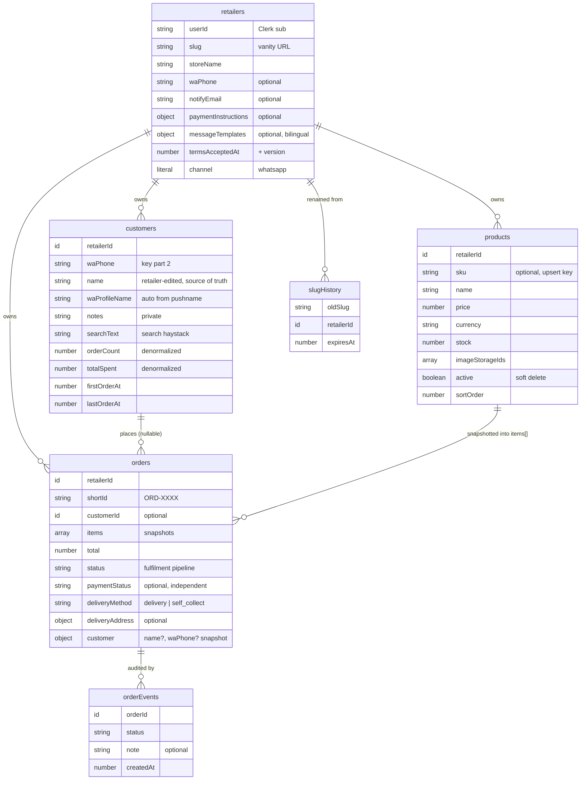

# Data Model

Canonical reference for the Convex schema. Source of truth: [`convex/schema.ts`](../convex/schema.ts). When the schema changes, update this file in the same PR.

## Design principles

- **Multi-tenant from day one.** Almost every row is owned by a `retailerId`. A retailer maps 1:1 to a Clerk user (`retailers.userId` = Clerk `sub`).
- **Channel-agnostic by construction.** Every order/inventory entity carries a `channel` field (currently always `"whatsapp"`). Future marketplace connectors (Shopee, Lazada, TikTok Shop) slot in without a schema rewrite. See [`messaging-channels.md`](./messaging-channels.md).
- **Denormalized customer aggregates.** Lifetime value / order counts live on the `customers` row and are refreshed on order create/cancel, so dashboard list/detail views never scan the `orders` table. See [`customer-database.md`](./customer-database.md).
- **Payment is a separate dimension from fulfilment.** An order has both a fulfilment `status` and an independent `paymentStatus`. See [`payment-handshake.md`](./payment-handshake.md).

## Entity-relationship overview

## Entities

### `retailers`

The tenant root. One per Clerk user.

| Field | Type | Notes |
|---|---|---|
| `userId` | string | Clerk subject (`sub` claim). Auth binding. |
| `slug` | string | Vanity storefront URL (`kedaipal.com/<slug>`). |
| `storeName` | string | Brand surfaced in WhatsApp copy via `{storeName}`. |
| `waPhone` | string? | Retailer's contact number (shopper-facing + diagnostics). |
| `notifyEmail` | string? | Operational alerts (new orders, payment claims). Independent of Clerk email; unset → no emails. |
| `logoStorageId` | string? | Public logo (storefront header, OG image fallback). |
| `currency`, `locale` | string?, `"en"\|"ms"`? | Defaults for the store. |
| `messageTemplates` | object? | Per-locale, per-status WhatsApp copy overrides. Omitted keys fall back to [`convex/lib/whatsappCopy.ts`](../convex/lib/whatsappCopy.ts). Supports `{shortId}`, `{storeName}`. |
| `paymentInstructions` | object? | Bank name/account + QR storage ID + note, shown in the confirmation reply. Each sub-field independent. |
| `termsAcceptedAt` / `Version`, `privacyAcceptedAt` / `Version`, `aupAcceptedAt` / `Version`, `acceptanceIp` | number?/string? | Legal consent tracking. Versions mirror [`convex/lib/legal.ts`](../convex/lib/legal.ts). See [`validation-and-rate-limits.md`](./validation-and-rate-limits.md#legal-consent). |
| `channel` | `"whatsapp"` | Future-proofing literal. |

**Indexes:** `by_user` (Clerk lookup on every dashboard request), `by_slug` (storefront routing).

### `slugHistory`

Audit trail of old slugs so renamed storefronts keep resolving for a grace window. Expired rows are purged daily by the `internalPurgeExpiredSlugHistory` cron ([`convex/crons.ts`](../convex/crons.ts)).

**Index:** `by_old_slug`.

### `products`

Catalog items, scoped to a retailer. **Soft-deleted** via `active: boolean` — never hard-deleted, so historical order line items stay resolvable.

| Field | Type | Notes |
|---|---|---|
| `sku` | string? | Stable retailer ID. When present, drives bulk-import upsert via `by_retailer_sku`. |
| `name`, `description`, `price`, `currency`, `stock` | — | `currency` must match the order currency at checkout. |
| `imageStorageIds` | string[] | Convex storage references (up to 5). |
| `active` | boolean | Soft-delete flag. |
| `sortOrder` | number | Custom storefront ranking. |

**Indexes:** `by_retailer`, `by_retailer_active` (storefront shows active only), `by_retailer_sku` (upsert collision check).

### `customers`

First-class CRM entity, **keyed by `(retailerId, waPhone)`**. Full lifecycle in [`customer-database.md`](./customer-database.md).

| Field | Type | Notes |
|---|---|---|
| `waPhone` | string | Key part 2. |
| `name` | string? | Retailer-edited override — **source of truth** for display name. Never overwritten by inbound data. |
| `waProfileName` | string? | Raw WhatsApp pushname, auto-refreshed on every inbound message. |
| `notes` | string? | Retailer-private; never exposed to shoppers. |
| `searchText` | string | Lowercase haystack (name + pushname + phone) powering the search index. |
| `orderCount`, `totalSpent`, `firstOrderAt`, `lastOrderAt` | number | **Denormalized aggregates**, refreshed on order create/cancel. |

Display name resolves `name → waProfileName → formatted phone` via `getDisplayName` (mirrored in [`convex/lib/customer.ts`](../convex/lib/customer.ts) + [`src/lib/customer.ts`](../src/lib/customer.ts)).

**Indexes:** `by_retailer`, `by_retailer_phone` (find-or-create key), `by_retailer_lastOrder` (recency sort), `by_retailer_ltv` (lifetime-value sort), `by_retailer_orderCount` (order-count sort). **Search index:** `search_customers` (filtered by `retailerId`).

### `orders`

The core transactional entity. Two independent dimensions:

- **Fulfilment** `status`: `pending → confirmed → packed → shipped → delivered` (+ `cancelled` from any stage). See [`order-lifecycle.md`](./order-lifecycle.md).
- **Payment** `paymentStatus`: `unpaid → claimed → received`. See [`payment-handshake.md`](./payment-handshake.md).

| Field | Type | Notes |
|---|---|---|
| `shortId` | string | `ORD-XXXX`. Alphabet excludes `O/0/I/1` (visual clarity in WhatsApp). Acts as a capability token for public mutations. |
| `customerId` | id? | Link to aggregated customer. Optional — null for phone-less link-in-bio checkouts until the phone is known. |
| `items` | object[] | Price/name **snapshots** `{productId, name, price, quantity}` — immune to later product edits. |
| `subtotal`, `total`, `currency` | — | Computed by `computeOrderTotals` ([`convex/lib/order.ts`](../convex/lib/order.ts)); currently `total === subtotal`. |
| `status` | union | Fulfilment pipeline (see above). |
| `customer` | object | Denormalized `{name?, waPhone?}` snapshot — channel-agnostic checkout capture. |
| `deliveryMethod` | `"delivery"\|"self_collect"`? | Defaults to `"delivery"`. |
| `deliveryAddress` | object? | **Invariant:** required when `delivery`, forbidden when `self_collect`. Validated by [`convex/lib/address.ts`](../convex/lib/address.ts). |
| `carrierTrackingUrl` | string? | Set by retailer on `shipped`; surfaced in tracking + WhatsApp. |
| `paymentStatus`, `paymentReference`, `paymentClaimedAt`, `paymentReceivedAt`, `paymentProofStorageId` | — | Payment handshake (independent of `status`). |

**Indexes:** `by_retailer`, `by_retailer_status`, `by_retailer_payment`, `by_shortId` (public tracking + confirmation lookup), `by_customer`.

### `orderEvents`

Immutable append-only audit log. One row per status transition or notable action. Notes seen in code: `"address_updated"`, `"payment_claimed"`, `"payment_received"`, `"payment_received_auto_confirm"`, `"Confirmed via WhatsApp"`.

**Index:** `by_order`.

## The mirrored-validation pattern

Validation helpers that must run on **both** the Convex backend and the React frontend are duplicated, not shared, because Convex bundles from `convex/` and the frontend bundles from `src/`:

| Concern | Backend | Frontend |
|---|---|---|
| Slug / phone / email | [`convex/lib/slug.ts`](../convex/lib/slug.ts) | [`src/lib/slug.ts`](../src/lib/slug.ts) |
| Customer display name | [`convex/lib/customer.ts`](../convex/lib/customer.ts) | [`src/lib/customer.ts`](../src/lib/customer.ts) |
| Legal versions | [`convex/lib/legal.ts`](../convex/lib/legal.ts) | [`src/lib/legal.ts`](../src/lib/legal.ts) |
| Address (backend) / form schema (frontend) | [`convex/lib/address.ts`](../convex/lib/address.ts) | [`src/lib/schemas.ts`](../src/lib/schemas.ts) |

**Rule:** when you change one side, change the mirror in the same PR. The backend copy is the security boundary; the frontend copy is UX.
