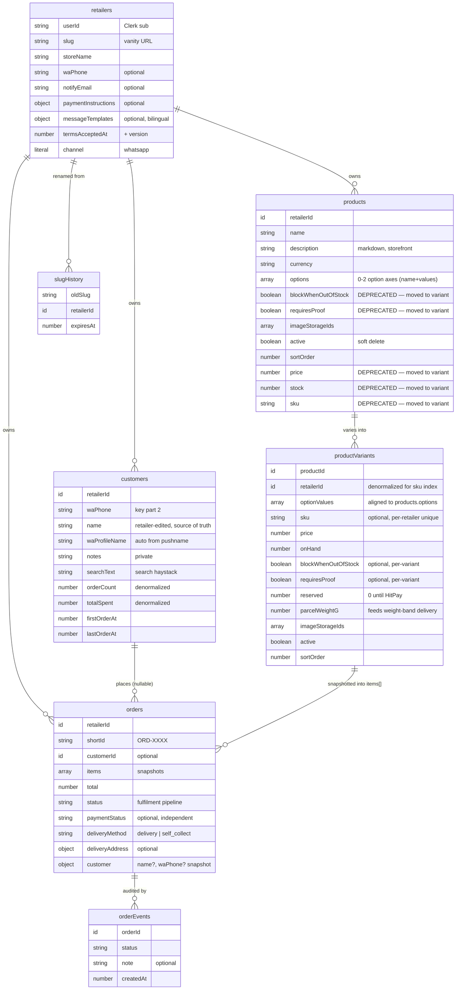

# Data Model

Canonical reference for the Convex schema. Source of truth: [`convex/schema.ts`](../convex/schema.ts). When the schema changes, update this file in the same PR.

## Design principles

- **Multi-tenant from day one.** Almost every row is owned by a `retailerId`. A retailer maps 1:1 to a Clerk user (`retailers.userId` = Clerk `sub`).
- **Channel-agnostic by construction.** Every order/inventory entity carries a `channel` field (currently always `"whatsapp"`). Future marketplace connectors (Shopee, Lazada, TikTok Shop) slot in without a schema rewrite. See [`messaging-channels.md`](./messaging-channels.md).
- **Denormalized customer aggregates.** Lifetime value / order counts live on the `customers` row and are refreshed on order create/cancel, so dashboard list/detail views never scan the `orders` table. See [`customer-database.md`](./customer-database.md).
- **Payment is a separate dimension from fulfilment.** An order has both a fulfilment `status` and an independent `paymentStatus`. See [`payment-handshake.md`](./payment-handshake.md).

## Entity-relationship overview

## Entities

### `retailers`

The tenant root. One per Clerk user.

| Field | Type | Notes |
|---|---|---|
| `userId` | string | Clerk subject (`sub` claim). Auth binding. |
| `slug` | string | Vanity storefront URL (`kedaipal.com/<slug>`). |
| `storeName` | string | Brand surfaced in WhatsApp copy via `{storeName}`. |
| `waPhone` | string? | Retailer's contact number (shopper-facing + diagnostics). |
| `notifyEmail` | string? | Operational alerts (new orders, payment claims). Independent of Clerk email; unset → no emails. |
| `logoStorageId` | string? | Public logo (storefront header, OG image fallback). |
| `currency`, `locale` | string?, `"en"\|"ms"`? | Defaults for the store. |
| `messageTemplates` | object? | Per-locale, per-status WhatsApp copy overrides. Omitted keys fall back to [`convex/lib/whatsappCopy.ts`](../convex/lib/whatsappCopy.ts). Supports `{shortId}`, `{storeName}`. |
| `paymentInstructions` | object? | Bank name/account + QR storage ID + note, shown in the confirmation reply. Each sub-field independent. |
| `termsAcceptedAt` / `Version`, `privacyAcceptedAt` / `Version`, `aupAcceptedAt` / `Version`, `acceptanceIp` | number?/string? | Legal consent tracking. Versions mirror [`convex/lib/legal.ts`](../convex/lib/legal.ts). See [`validation-and-rate-limits.md`](./validation-and-rate-limits.md#legal-consent). |
| `channel` | `"whatsapp"` | Future-proofing literal. |

**Indexes:** `by_user` (Clerk lookup on every dashboard request), `by_slug` (storefront routing).

### `slugHistory`

Audit trail of old slugs so renamed storefronts keep resolving for a grace window. Expired rows are purged daily by the `internalPurgeExpiredSlugHistory` cron ([`convex/crons.ts`](../convex/crons.ts)).

**Index:** `by_old_slug`.

### `products`

Catalog items, scoped to a retailer. **Soft-deleted** via `active: boolean` — never hard-deleted, so historical order line items stay resolvable. A product is the *listing*; the sellable units are its [`productVariants`](#productvariants). Every product resolves to **≥1 variant** — a no-option product has exactly one implicit variant (`optionValues: []`); there is no separate "simple product" code path. Full design: [`product-variants.md`](./product-variants.md).

| Field | Type | Notes |
|---|---|---|
| `name` | string | Listing title. |
| `description` | string? | Rendered as **sanitized markdown** on the storefront (specs, "what's included"). |
| `currency` | string | Must match the order currency at checkout. |
| `options` | object[]? | 0–2 **option axes** `{name, values[]}`, ordered (drives picker order). Empty/undefined = no axes. Capped at 2 axes / 50 variants. |
| `imageStorageIds` | string[] | Product-level hero gallery (up to 5). **Order is meaningful** — index 0 is the storefront cover. The listing editor lets the seller drag-to-reorder the gallery (same `SortableList` primitive as elsewhere); the array is persisted in display order, no separate "primary" flag. |
| `active` | boolean | Soft-delete flag. |
| `sortOrder` | number | Custom storefront ranking. **Storefront** `list` (active-only) orders ascending `sortOrder`, then `createdAt`. **Dashboard** `listAll` orders **active-first, then `sortOrder`, then `createdAt`** — so archived products sink to the end (archiving moves a product down with no renumber). `create` sets `sortOrder: Date.now()` so new products append. Inline drag-and-drop in the dashboard "All" view reorders the **active** products and calls `products.reorder({ retailerId, orderedIds })` (full set: reordered active + archived kept last), which assigns `sortOrder = index`. |
| `blockWhenOutOfStock`, `requiresProof` | **DEPRECATED** | Moved to `productVariants` (now **per-variant**). Reads fall back to these product-level values when a variant's own flag is unset (`variant.X ?? product.X`), so they're kept optional until the narrow step. **Set the variant flags, not these.** |
| `price`, `stock`, `sku` | **DEPRECATED** | Moved to `productVariants`. Kept optional during the flat→variant migration (widen-migrate-narrow); dropped in the narrow step. **Do not read.** |

**Indexes:** `by_retailer`, `by_retailer_active` (storefront shows active only), `by_retailer_sku` (legacy; SKU uniqueness now enforced on the variant).

### `productVariants`

The first-class **sellable unit**. `optionValues` is positionally aligned with the parent `products.options`. SKU uniqueness moved here (SKUs identify sellable units). Frozen onto orders via `orders.items[].variantId`/`variantLabel`.

| Field | Type | Notes |
|---|---|---|
| `productId` | id | Parent listing. |
| `retailerId` | id | Denormalized so the per-retailer SKU index can live here. |
| `optionValues` | string[] | Positionally aligned with `products.options`; `[]` for the implicit default. |
| `sku` | string? | Optional, **unique per retailer** (`by_retailer_sku`). |
| `price` | number | Minor units. Server-authoritative at order time. |
| `onHand` | number | Stock. Decremented on order create / restored on cancel **only when** this variant hard-blocks (`blockWhenOutOfStock` resolves true). |
| `blockWhenOutOfStock` | boolean? | **Per-variant.** `true` = this variant with `onHand ≤ 0` is unsellable. Undefined/false = **made-to-order** (sells at zero, never reserved). Falls back to the deprecated product-level flag when unset. Lets a mixed listing pair fixed sizes (hard-block) with a "Custom" made-to-order variant. |
| `requiresProof` | boolean? | **Per-variant.** `true` = any order containing this variant is **mockup-gated** (can't be packed until the buyer approves a mockup). Falls back to the product-level flag when unset. See [`proof-approval.md`](./proof-approval.md). |
| `reserved` | number | Forward-wired for HitPay holds; stays `0` until payments go live. |
| `parcelWeightG` | number | Parcel weight (grams). Feeds weight-band delivery (separate task); `0` = unset. |
| `imageStorageIds` | string[] | Per-variant images (up to 3); storefront falls back to the product hero when empty. |
| `active` | boolean | Per-variant deactivate — inactive variants are hidden from the storefront. |
| `sortOrder` | number | Row order within the product. |

**Indexes:** `by_product` (load a listing's variants), `by_retailer_sku` (SKU uniqueness check).

### `customers`

First-class CRM entity, **keyed by `(retailerId, waPhone)`**. Full lifecycle in [`customer-database.md`](./customer-database.md).

| Field | Type | Notes |
|---|---|---|
| `waPhone` | string | Key part 2. |
| `name` | string? | Retailer-edited override — **source of truth** for display name. Never overwritten by inbound data. |
| `waProfileName` | string? | Raw WhatsApp pushname, auto-refreshed on every inbound message. |
| `notes` | string? | Retailer-private; never exposed to shoppers. |
| `searchText` | string | Lowercase haystack (name + pushname + phone) powering the search index. |
| `orderCount`, `totalSpent`, `firstOrderAt`, `lastOrderAt` | number | **Denormalized aggregates**, refreshed on order create/cancel. |

Display name resolves `name → waProfileName → formatted phone` via `getDisplayName` (mirrored in [`convex/lib/customer.ts`](../convex/lib/customer.ts) + [`src/lib/customer.ts`](../src/lib/customer.ts)).

**Indexes:** `by_retailer`, `by_retailer_phone` (find-or-create key), `by_retailer_lastOrder` (recency sort), `by_retailer_ltv` (lifetime-value sort), `by_retailer_orderCount` (order-count sort). **Search index:** `search_customers` (filtered by `retailerId`).

### `orders`

The core transactional entity. Two independent dimensions:

- **Fulfilment** `status`: `pending → confirmed → packed → shipped → delivered` (+ `cancelled` from any stage). See [`order-lifecycle.md`](./order-lifecycle.md).
- **Payment** `paymentStatus`: `unpaid → claimed → received`. See [`payment-handshake.md`](./payment-handshake.md).

| Field | Type | Notes |
|---|---|---|
| `shortId` | string | `ORD-XXXX`. Alphabet excludes `O/0/I/1` (visual clarity in WhatsApp). Acts as a capability token for public mutations. |
| `customerId` | id? | Link to aggregated customer. Optional — null for phone-less link-in-bio checkouts until the phone is known. |
| `items` | object[] | Line **snapshots** `{productId, variantId?, name, variantLabel?, price, quantity}` — immune to later product/variant edits. `variantId`/`variantLabel` absent only on legacy (pre-variant) orders. |
| `subtotal`, `total`, `currency` | — | Computed by `computeOrderTotals` ([`convex/lib/order.ts`](../convex/lib/order.ts)); currently `total === subtotal`. |
| `status` | union | Fulfilment pipeline (see above). |
| `customer` | object | Denormalized `{name?, waPhone?}` snapshot — channel-agnostic checkout capture. |
| `deliveryMethod` | `"delivery"\|"self_collect"`? | Defaults to `"delivery"`. |
| `deliveryAddress` | object? | **Invariant:** required when `delivery`, forbidden when `self_collect`. Validated by [`convex/lib/address.ts`](../convex/lib/address.ts). |
| `fulfilmentDate` | number? | When the buyer needs it (delivery **or** pickup) — epoch-ms of a MYT-midnight day. Drives the inbox default sort + "Due" chips. Validated to `[today + retailer notice, today + 30]`. See [`fulfilment-date.md`](./fulfilment-date.md). |
| `carrierTrackingUrl` | string? | Set by retailer on `shipped`; surfaced in tracking + WhatsApp. |
| `paymentStatus`, `paymentReference`, `paymentClaimedAt`, `paymentReceivedAt`, `paymentProofStorageId` | — | Payment handshake (independent of `status`). |
| `mockupStatus`, `mockupImageStorageId`, `mockupChangeNote`, `mockupSubmittedAt`, `mockupApprovedAt`, `mockupWaivedAt` | — | **Mockup/proof approval** — a *third* independent dimension (like payment), gating `confirmed→packed`. `mockupStatus`: `pending → submitted → approved` (+ `changes_requested` loop). Undefined = order has no proof-required item. ⚠️ "mockup" ≠ payment "proof". See [`proof-approval.md`](./proof-approval.md). |

**Indexes:** `by_retailer`, `by_retailer_status`, `by_retailer_payment`, `by_retailer_mockup`, `by_shortId` (public tracking + confirmation lookup), `by_customer`.

### `orderEvents`

Immutable append-only audit log. One row per status transition or notable action. Notes seen in code: `"address_updated"`, `"payment_claimed"`, `"payment_received"`, `"payment_received_auto_confirm"`, `"Confirmed via WhatsApp"`.

**Index:** `by_order`.

## The mirrored-validation pattern

Validation helpers that must run on **both** the Convex backend and the React frontend are duplicated, not shared, because Convex bundles from `convex/` and the frontend bundles from `src/`:

| Concern | Backend | Frontend |
|---|---|---|
| Slug / phone / email | [`convex/lib/slug.ts`](../convex/lib/slug.ts) | [`src/lib/slug.ts`](../src/lib/slug.ts) |
| Customer display name | [`convex/lib/customer.ts`](../convex/lib/customer.ts) | [`src/lib/customer.ts`](../src/lib/customer.ts) |
| Variant helpers (label, cartesian, caps) | [`convex/lib/variant.ts`](../convex/lib/variant.ts) | [`src/lib/variant.ts`](../src/lib/variant.ts) |
| Legal versions | [`convex/lib/legal.ts`](../convex/lib/legal.ts) | [`src/lib/legal.ts`](../src/lib/legal.ts) |
| Address (backend) / form schema (frontend) | [`convex/lib/address.ts`](../convex/lib/address.ts) | [`src/lib/schemas.ts`](../src/lib/schemas.ts) |

**Rule:** when you change one side, change the mirror in the same PR. The backend copy is the security boundary; the frontend copy is UX.
