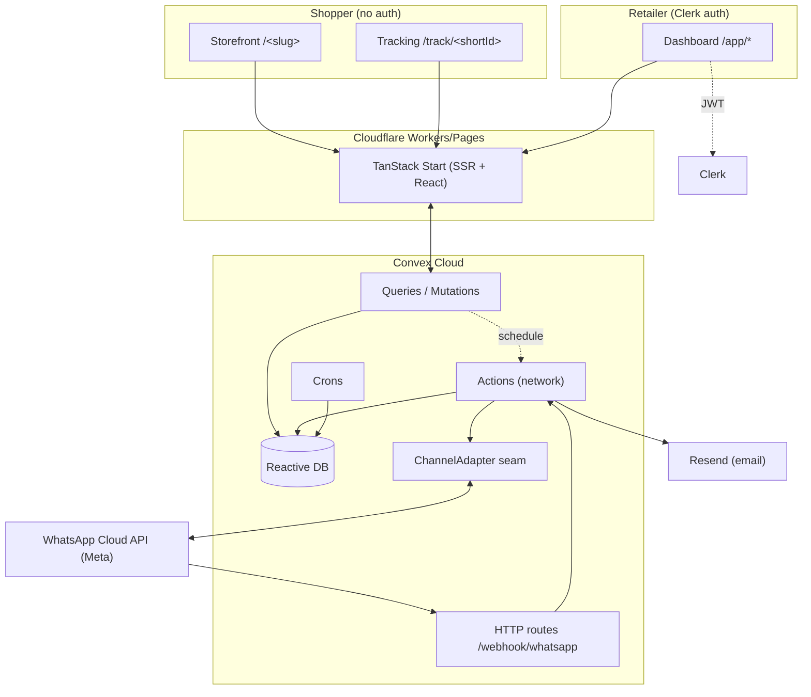

# Onboarding & Knowledge Transfer

A guided path for a new **CTO or engineer** joining Kedaipal. Read top-to-bottom on day one; it layers strategy → architecture → setup → codebase → domain logic → conventions → first contribution.

> **TL;DR:** Kedaipal is a WhatsApp-first order hub for Malaysian F&B sellers, built on **Convex** (backend/DB) + **TanStack Start** (React frontend) + **Clerk** (auth), hosted on **Cloudflare** + **Convex Cloud**. The wedge is a **shared, Meta-verified WhatsApp Business Account** so retailers go live in minutes without their own WABA.

---

## Part 1 — Strategy (read this first, especially as CTO)

Two documents carry the business context. Budget ~35 minutes.

1. **[`PROJECT_CONTEXT.md`](../PROJECT_CONTEXT.md)** — full strategy: product definition, target cohort, vision, competitive landscape, business model, pricing, operating entity, guiding principles, open questions.
2. **[`CLAUDE.md`](../CLAUDE.md)** — code-level conventions + the current MVP status, the active 6-sprint roadmap, and the architectural constraints you must not break.

The five things to internalize:

- **The pain we solve.** F&B sellers (a) miss orders buried in WhatsApp chat history and (b) waste hours chasing payment confirmation. Everything maps back to those two.
- **The moat.** Kedaipal owns **one** Meta-verified WABA that sends for every retailer. Retailers need no WABA, no business verification, no SSM. "Live in 5 minutes" is structural, not marketing — it's the wedge vs. WATI / SleekFlow / EasyStore / Orderla.
- **Positioning vs. Orderla.** Orderla is a *form*; Kedaipal is a *full storefront*. Public line: *"Where Orderla users graduate to when their order form falls apart."*
- **Pricing (locked).** Starter RM79 / Pro RM149 ★ / Scale RM299, 14-day trial, no card. No free tier until 50 paying customers.
- **Money boundary.** Subscription billing flows to Kedaipal (Stripe + HitPay/Billplz). **Customer payment money is retailer-owned** (HitPay Connect / Billplz / Stripe Connect) — Kedaipal is never merchant of record for shopper transactions.

---

## Part 2 — Architecture



Key architectural ideas (all enforced — see "Architectural Constraints" in [`CLAUDE.md`](../CLAUDE.md)):

- **Multi-tenant via slugs from day one.** Storefront is `kedaipal.com/<slug>`; everything is keyed by `retailerId`. See [`data-model.md`](./data-model.md).
- **Channel-adapter seam.** WhatsApp is one of N channels behind a uniform `ChannelAdapter` ([`convex/lib/channels/`](../convex/lib/channels/)). Order orchestration is channel-neutral; provider wire logic (Meta payloads, signature scheme) lives inside the adapter. Adding a channel = new adapter + registry entry + webhook route. See [`messaging-channels.md`](./messaging-channels.md).
- **`channel` field everywhere.** Every order/inventory row carries `channel: "whatsapp"` so marketplace connectors slot in without schema rewrites.
- **Webhook fails closed.** Inbound `POST /webhook/whatsapp` verifies Meta's `X-Hub-Signature-256` (HMAC-SHA256 with `WHATSAPP_APP_SECRET`). Missing secret → 500. See [`whatsapp-webhook-security.md`](./whatsapp-webhook-security.md).
- **Mobile-first is a hard requirement.** ≥44px tap targets, single column, sticky bottom CTAs.

---

## Part 3 — Local setup

Prerequisites: **Node ≥20**, **pnpm 10.18** (`corepack enable` or `npm i -g pnpm`).

```bash
git clone <repo> && cd kedaipal
pnpm install
```

Then follow the canonical setup in [`.env.local.example`](../.env.local.example) (it documents the exact order):

1. **Convex** — run `pnpm convex:dev` once. Log in, create a deployment. This auto-writes `CONVEX_DEPLOYMENT` and `VITE_CONVEX_URL` into `.env.local`.
2. **Clerk** — create an app at [dashboard.clerk.com](https://dashboard.clerk.com). Copy the publishable key → `VITE_CLERK_PUBLISHABLE_KEY`, secret key → `CLERK_SECRET_KEY`.
3. **Clerk JWT template** — create a JWT template named **`convex`** (required by `ConvexProviderWithClerk`). Copy its Issuer URL.
4. **Wire Clerk → Convex** — in the Convex dashboard → Settings → Authentication, add a provider with the Clerk Issuer URL + applicationID ([docs](https://docs.convex.dev/auth/clerk)).
5. **Optional integrations** (only when working on those features):
   - WhatsApp Cloud API: `WHATSAPP_PHONE_NUMBER_ID`, `WHATSAPP_ACCESS_TOKEN`, `WHATSAPP_VERIFY_TOKEN`, plus `WHATSAPP_APP_SECRET` + `APP_URL` set on the Convex deployment (`npx convex env set KEY value`).
   - Email: `RESEND_API_KEY`, `EMAIL_FROM` (verify the sender domain first).
   - Analytics: `VITE_GA_MEASUREMENT_ID`.

> **Env var split:** `VITE_*` vars are frontend (`.env.local`); backend secrets live on the Convex deployment via `npx convex env set` (`--prod` for production). Validated at load in [`src/lib/env.ts`](../src/lib/env.ts).

Run everything:

```bash
pnpm dev:all     # Convex + Vite frontend concurrently
# or separately: pnpm convex:dev  (terminal 1) + pnpm dev (terminal 2)
pnpm seed        # optional: populate development data (convex/seed.ts)
```

Frontend at http://localhost:3000.

---

## Part 4 — Codebase tour

```
kedaipal/
├── convex/                 # Backend: schema, functions, HTTP actions, crons
│   ├── schema.ts           # ← data model, start here
│   ├── orders.ts           # order + payment mutations/queries
│   ├── whatsapp.ts         # confirmation + status/payment notifications
│   ├── customers.ts        # CRM mutations/queries
│   ├── products.ts         # catalog + bulk import/export
│   ├── retailers.ts        # retailer + slug + legal consent
│   ├── http.ts             # webhook routes (Meta verify + inbound)
│   ├── email.ts / crons.ts # Resend alerts / scheduled jobs
│   ├── seed.ts             # dev data
│   └── lib/                # pure helpers (no Convex imports → unit-testable)
│       ├── order.ts, address.ts, slug.ts, customer.ts, legal.ts
│       ├── rateLimiter.ts, whatsappCopy.ts, emailCopy.ts
│       └── channels/       # ChannelAdapter seam (types, registry, whatsapp/)
├── src/                    # Frontend: TanStack Start (React)
│   ├── routes/             # file-based routing (see below)
│   ├── components/         # ui/, dashboard/, storefront/, landing/, forms/
│   ├── hooks/              # useCart, useSlugAvailability, …
│   └── lib/                # env, convex client, schemas (Zod), + mirrored validators
└── docs/                   # ← you are here
```

**Routing map** ([`src/routes/`](../src/routes/), file-based TanStack Router):

| Route | Purpose | Auth |
|---|---|---|
| `/` | Landing | public |
| `/$slug` | **Storefront** (browse, cart) | public |
| `/track/$shortId` | Order tracking + "I've paid" | public (shortId = capability) |
| `/pricing`, `/cost` | Pricing + cost calculator | public |
| `/terms`, `/privacy`, `/acceptable-use` | Legal | public |
| `/onboarding` | Retailer setup (redirect target when retailer is null) | Clerk |
| `/app`, `/app/products/*`, `/app/orders/*`, `/app/customers/*`, `/app/settings` | Dashboard | Clerk |

**The mirrored-validation pattern** (important): validators that run on both backend and frontend are *duplicated*, not shared, because Convex bundles from `convex/` and the app from `src/` — e.g. `slug.ts`, `customer.ts`, `legal.ts`. Change one side → change the mirror in the same PR. Details in [`validation-and-rate-limits.md`](./validation-and-rate-limits.md#the-mirrored-validation-pattern).

---

## Part 5 — Domain logic reading order

Read these in order to understand how the product actually works:

1. **[`data-model.md`](./data-model.md)** — entities, relationships, multi-tenancy, indexes.
2. **[`order-lifecycle.md`](./order-lifecycle.md)** — checkout → wa.me handoff → confirmation → fulfilment states.
3. **[`payment-handshake.md`](./payment-handshake.md)** — the `unpaid → claimed → received` flow.
4. **[`customer-database.md`](./customer-database.md)** — CRM-lite, denormalized aggregates, name resolution.
5. **[`messaging-channels.md`](./messaging-channels.md)** — the ChannelAdapter seam (how a 2nd channel would land).
6. **[`whatsapp-webhook-security.md`](./whatsapp-webhook-security.md)** — signature verification, fail-closed.
7. **[`validation-and-rate-limits.md`](./validation-and-rate-limits.md)** — trust boundaries, guardrails, legal consent.

The [`docs/README.md`](./README.md) index groups everything (including roadmap docs).

---

## Part 6 — Conventions

- **MANDATORY before writing Convex code:** read [`convex/_generated/ai/guidelines.md`](../convex/_generated/ai/guidelines.md). It overrides general Convex knowledge (function registration, validators, pagination, auth, scheduling, file storage).
- **Lint/format:** Biome (`pnpm lint`, `pnpm format`, `pnpm check`) — not Prettier/ESLint.
- **Types:** `pnpm typecheck` (`tsc --noEmit`). Avoid `any`; validate external input with Zod ([`src/lib/schemas.ts`](../src/lib/schemas.ts)).
- **Testing:** Vitest + `convex-test` on the edge runtime (`pnpm test`). Pure helpers in `convex/lib/*` are kept Convex-import-free precisely so they unit-test in isolation. Backend tests sit beside code as `convex/*.test.ts`; frontend lib tests as `src/lib/*.test.ts`.
- **Immutability:** prefer new objects over in-place mutation (see repo coding rules).
- **Side effects:** mutations stay pure transactions; network work (WhatsApp, email) is scheduled via `ctx.scheduler.runAfter(0, …)` into actions — fire-and-forget, errors logged not thrown.
- **Mobile-first:** ≥44px tap targets, single column, sticky bottom CTAs.

---

## Part 7 — First contribution

1. Get `pnpm dev:all` running and `pnpm seed`'d; sign up through `/onboarding` to create a retailer.
2. Walk a real order end-to-end: storefront → checkout → copy the `wa.me` link → (in dev, confirmation degrades to text). Watch the order move in `/app/orders`.
3. Run the suite: `pnpm test`. Pick a `convex/lib/*` helper and read its test to learn the patterns.
4. **Good starter tasks:** anything scoped to a single `convex/lib/*` helper + its test, or a storefront/dashboard component. Check the active sprint in [`CLAUDE.md`](../CLAUDE.md) and the [ClickUp roadmap](https://app.clickup.com/90182681518/v/li/901818308046).

Common commands:

| Command | Does |
|---|---|
| `pnpm dev:all` | Convex + frontend |
| `pnpm test` | Vitest (single run) |
| `pnpm typecheck` | `tsc --noEmit` |
| `pnpm check` | Biome lint + format |
| `pnpm seed` | Seed dev data |
| `npx convex run <file>:<fn> '<json>'` | Invoke a Convex function directly (e.g. backfills, diagnostics) |
