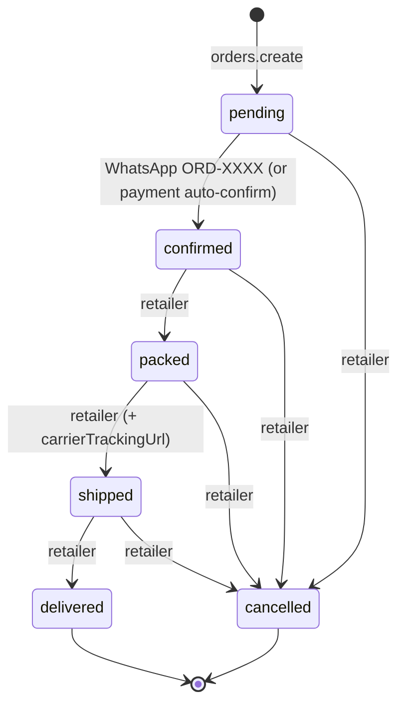
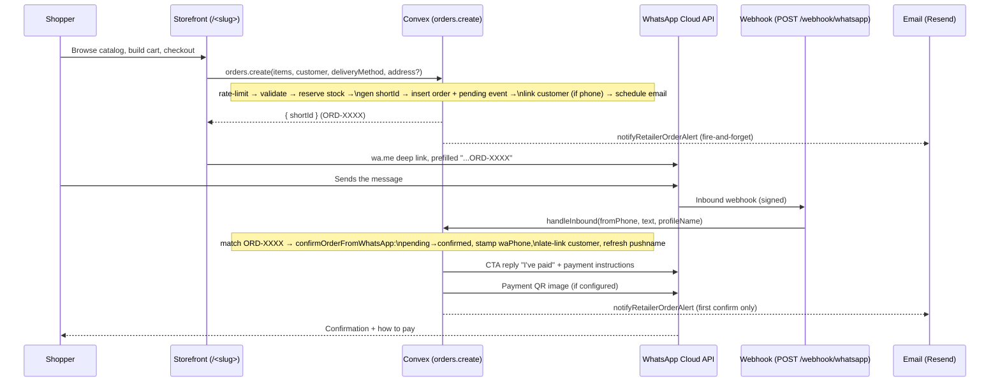

# Order Lifecycle

How an order is created, confirmed, and driven through fulfilment. Payment is a separate dimension — see [`payment-handshake.md`](./payment-handshake.md).

**Primary source files:**
- [`convex/orders.ts`](../convex/orders.ts) — mutations/queries (`create`, `updateStatus`, `updateDeliveryAddress`, …)
- [`convex/lib/order.ts`](../convex/lib/order.ts) — pure helpers (`generateShortId`, `computeOrderTotals`)
- [`convex/whatsapp.ts`](../convex/whatsapp.ts) — confirmation + status notifications
- [`convex/lib/whatsappCopy.ts`](../convex/lib/whatsappCopy.ts) — bilingual message rendering

## Fulfilment state machine

`status` lives on the `orders` row. The pipeline is **forward-flowing**, and `cancelled` is reachable from any non-terminal state.

Notes:
- `orders.create` only ever produces `pending`. Validators in `updateStatus` (`transitionStatusValidator`) accept `confirmed | packed | shipped | delivered | cancelled` — `pending` is never a manual target.
- The transition graph is **not hard-enforced** in code beyond the validators — retailer-driven transitions trust the dashboard UI. The one server-enforced rule is around stock and aggregates on the *first* entry into `cancelled` (see below).

## End-to-end order flow

## `orders.create` — checkout

Public mutation (no auth — the storefront is anonymous). Steps, in order ([`convex/orders.ts`](../convex/orders.ts)):

1. **Rate limit first** — `orderCreate` keyed by `retailerId` (token bucket: burst 5, 30/min). Throttle before any DB reads. See [`validation-and-rate-limits.md`](./validation-and-rate-limits.md).
2. **Delivery-method invariant** — `delivery` requires `deliveryAddress`; `self_collect` forbids it. Default method is `delivery`.
3. **Address validation** — `assertValidAddress` (Malaysia-only) sanitizes and trims.
4. **Phone validation** — `assertValidWaPhone` if a phone was provided (optional at checkout).
5. **Item validation** — 1–100 items. Each item names a **variant** by `variantId` (preferred) or a single-variant product's `productId` (resolved to its sole variant; ambiguous for multi-variant products → rejected). The variant + its parent product must belong to the retailer, both be `active`, and match the order currency. **Stock is enforced only when the parent product has `blockWhenOutOfStock = true`** — made-to-order products (frozen pack-to-order, metal prints) never block. Quantities for the same variant across multiple line items are summed before the (conditional) `onHand` check. Each line snapshots `{productId, variantId, name, variantLabel, price, quantity}`.
6. **Compute totals** — `computeOrderTotals` (currently `total === subtotal`).
7. **Reserve stock** — for **hard-block variants only**, patch each variant's `onHand` down within the same transaction (atomic; rolls back on any failure). Variants are re-fetched fresh to avoid stale values. Made-to-order variants are never decremented.
8. **Collision-safe `shortId`** — up to 3 attempts via `generateShortId`; throws if all collide.
9. **Insert order** (`status: "pending"`) + a `pending` `orderEvents` row.
10. **Early customer link** — if a phone is known, `linkOrderToCustomer` creates/updates the customer and stamps `customerId`. Phone-less orders are linked later (see confirmation).
11. **Fire-and-forget email** — schedule `notifyRetailerOrderAlert`.

Returns `{ shortId }`, which the storefront embeds into the `wa.me` deep link.

## WhatsApp confirmation

Inbound flow lives in [`convex/whatsapp.ts`](../convex/whatsapp.ts), entered from the webhook (`POST /webhook/whatsapp`, signature-verified — see [`whatsapp-webhook-security.md`](./whatsapp-webhook-security.md)).

- `handleInbound` matches `SHORT_ID_REGEX` against the message text.
  - **No match** → friendly English fallback ("To place an order, browse our catalog…").
  - **Match** → `confirmOrderFromWhatsApp`.
- `confirmOrderFromWhatsApp` (internal mutation) is **idempotent**:
  - If `pending`, transitions to `confirmed` and writes a `"Confirmed via WhatsApp"` event.
  - Stamps `order.customer.waPhone` if it was empty (link-in-bio backfill).
  - **Late customer link** — if `customerId` is still null, normalizes the phone and calls `linkOrderToCustomer`. Orders already linked at checkout are skipped (no double counting).
  - Refreshes the customer's `waProfileName` from the sender's pushname (never clobbers a retailer-edited `name`).
- The reply is rendered in the retailer's locale (`en`/`ms`) and sent as a **CTA message** ("I've paid" button → tracking page). It degrades to plain text when interactive buttons aren't available (e.g. non-HTTPS `APP_URL` in dev). A **hard-coded, non-overridable** transfer-reference line is always appended (see [`payment-handshake.md`](./payment-handshake.md#transfer-reference)). A payment QR is sent as a follow-up image if configured.

## `orders.updateStatus` — retailer transitions

Auth-gated (Clerk); ownership checked (`retailer.userId === identity.subject`). Behaviour:

- **Mockup gate** — a `→ packed` transition is **rejected** for a mockup-required order (`mockupStatus !== undefined`) unless `mockupStatus === "approved"` or the seller has waived it (`mockupWaivedAt` set). Production can't start before the buyer signs off (or the seller deliberately proceeds). Cancellation is never gated. See [`proof-approval.md`](./proof-approval.md).
- **Stock restoration on cancel** — only on the *first* transition into `cancelled` (idempotent). Quantities are re-summed per **variant** and added back to `onHand`, but **only for variants whose parent product hard-blocks** (made-to-order variants were never decremented, so nothing to restore). Deleted variants and legacy items without a `variantId` are skipped.
- **Customer aggregate decrement on cancel** — same first-transition guard; reverses this order's contribution via `decrementAggregatesForCancel` (floors at zero).
- **Carrier tracking URL** — accepted only when `status === "shipped"` (trimmed, non-empty). `setCarrierTrackingUrl` is a separate mutation for setting/clearing it later, intentionally not status-restricted.
- **Audit** — every transition writes an `orderEvents` row.
- **Notification** — schedules `notifyStatusChange` (fire-and-forget). It no-ops for `pending`/`confirmed` (those are covered by the confirmation flow) and when the order has no `customerWaPhone`. Messages are localized; `shipped` includes the carrier URL when set.

## Public shopper mutations (capability = `shortId`)

Trust model: knowing the `shortId` is the capability — anyone with the tracking link can act. Each is rate-limited per `shortId`.

- **`updateDeliveryAddress`** — only while `pending` (locked after confirmation); rejected for `self_collect`. Writes an `"address_updated"` event.
- **Payment mutations** (`claimPayment`, `generateOrderProofUploadUrl`) — see [`payment-handshake.md`](./payment-handshake.md).

## `shortId` design

`ORD-` + 4 chars from `ABCDEFGHJKLMNPQRSTUVWXYZ23456789` ([`convex/lib/order.ts`](../convex/lib/order.ts)). The alphabet **excludes `O`, `0`, `I`, `1`** so shoppers can't mistype it when copying the transfer reference into their banking app. ~1M combinations; collisions handled by the 3-retry loop in `create`.
