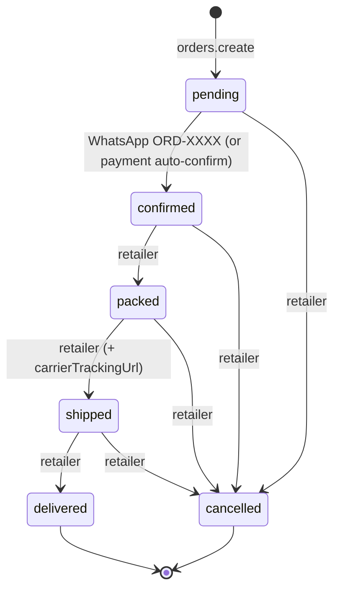
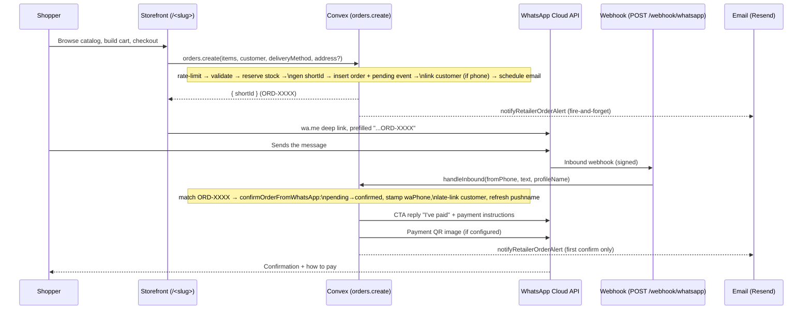

# Order Lifecycle

How an order is created, confirmed, and driven through fulfilment. Payment is a separate dimension — see [`payment-handshake.md`](./payment-handshake.md).

**Primary source files:**
- [`convex/orders.ts`](../convex/orders.ts) — mutations/queries (`create`, `updateStatus`, `updateDeliveryAddress`, …)
- [`convex/lib/order.ts`](../convex/lib/order.ts) — pure helpers (`generateShortId`, `computeOrderTotals`)
- [`convex/whatsapp.ts`](../convex/whatsapp.ts) — confirmation + status notifications
- [`convex/lib/whatsappCopy.ts`](../convex/lib/whatsappCopy.ts) — bilingual message rendering

## Fulfilment state machine

`status` lives on the `orders` row. The pipeline is **forward-flowing**, and `cancelled` is reachable from any non-terminal state.

Notes:
- `orders.create` only ever produces `pending`. Validators in `updateStatus` (`transitionStatusValidator`) accept `confirmed | packed | shipped | delivered | cancelled` — `pending` is never a manual target.
- The transition graph is **not hard-enforced** in code beyond the validators — retailer-driven transitions trust the dashboard UI. The one server-enforced rule is around stock and aggregates on the *first* entry into `cancelled` (see below).

## End-to-end order flow

## `orders.create` — checkout

Public mutation (no auth — the storefront is anonymous). Steps, in order ([`convex/orders.ts`](../convex/orders.ts)):

1. **Rate limit first** — `orderCreate` keyed by `retailerId` (token bucket: burst 5, 30/min). Throttle before any DB reads. See [`validation-and-rate-limits.md`](./validation-and-rate-limits.md).
2. **Delivery-method invariant** — `delivery` requires `deliveryAddress`; `self_collect` forbids it. Default method is `delivery`.
3. **Address validation** — `assertValidAddress` (Malaysia-only) sanitizes and trims.
4. **Phone validation** — `assertValidWaPhone` if a phone was provided (optional at checkout).
5. **Item validation** — 1–100 items. Each item names a **variant** by `variantId` (preferred) or a single-variant product's `productId` (resolved to its sole variant; ambiguous for multi-variant products → rejected). The variant + its parent product must belong to the retailer, both be `active`, and match the order currency. **Stock is enforced only when the variant hard-blocks** — `variant.blockWhenOutOfStock ?? product.blockWhenOutOfStock` resolves true. Made-to-order variants (frozen pack-to-order, metal prints, a "Custom" size) never block, even when a sibling variant in the same listing does. Quantities for the same variant across multiple line items are summed before the (conditional) `onHand` check. Each line snapshots `{productId, variantId, name, variantLabel, price, quantity}`.
6. **Compute totals** — `computeOrderTotals` (currently `total === subtotal`).
7. **Reserve stock** — for **hard-block variants only** (resolved per-variant), patch each variant's `onHand` down within the same transaction (atomic; rolls back on any failure). Variants are re-fetched fresh to avoid stale values. Made-to-order variants are never decremented.
8. **Collision-safe `shortId`** — up to 3 attempts via `generateShortId`; throws if all collide.
9. **Insert order** (`status: "pending"`) + a `pending` `orderEvents` row.
10. **Early customer link** — if a phone is known, `linkOrderToCustomer` creates/updates the customer and stamps `customerId`. Phone-less orders are linked later (see confirmation).
11. **Fire-and-forget email** — schedule `notifyRetailerOrderAlert`.

Returns `{ shortId }`, which the storefront embeds into the `wa.me` deep link.

## WhatsApp confirmation

Inbound flow lives in [`convex/whatsapp.ts`](../convex/whatsapp.ts), entered from the webhook (`POST /webhook/whatsapp`, signature-verified — see [`whatsapp-webhook-security.md`](./whatsapp-webhook-security.md)).

- `handleInbound` matches `SHORT_ID_REGEX` against the message text.
  - **No match** → friendly English fallback ("To place an order, browse our catalog…").
  - **Match** → `confirmOrderFromWhatsApp`.
- `confirmOrderFromWhatsApp` (internal mutation) is **idempotent**:
  - If `pending`, transitions to `confirmed` and writes a `"Confirmed via WhatsApp"` event.
  - Stamps `order.customer.waPhone` if it was empty (link-in-bio backfill).
  - **Late customer link** — if `customerId` is still null, normalizes the phone and calls `linkOrderToCustomer`. Orders already linked at checkout are skipped (no double counting).
  - Refreshes the customer's `waProfileName` from the sender's pushname (never clobbers a retailer-edited `name`).
- The reply is rendered in the retailer's locale (`en`/`ms`) and sent as a **CTA message** ("I've paid" button → tracking page). It degrades to plain text when interactive buttons aren't available (e.g. non-HTTPS `APP_URL` in dev). A **hard-coded, non-overridable** transfer-reference line is always appended (see [`payment-handshake.md`](./payment-handshake.md#transfer-reference)). A payment QR is sent as a follow-up image if configured.

## `orders.updateStatus` — retailer transitions

Auth-gated (Clerk); ownership checked (`retailer.userId === identity.subject`). Behaviour:

- **Mockup gate** — a `→ packed` transition is **rejected** for a mockup-required order (`mockupStatus !== undefined`) unless `mockupStatus === "approved"` or the seller has waived it (`mockupWaivedAt` set). An order is mockup-required when **≥1 line's variant** resolves `requiresProof` true (per-variant override ?? product default), stamped at create time. Production can't start before the buyer signs off (or the seller deliberately proceeds). Cancellation is never gated. See [`proof-approval.md`](./proof-approval.md).
- **Stock restoration on cancel** — only on the *first* transition into `cancelled` (idempotent). Quantities are re-summed per **variant** and added back to `onHand`, but **only for variants that hard-block** (resolved per-variant; made-to-order variants were never decremented, so nothing to restore). Deleted variants and legacy items without a `variantId` are skipped.
- **Customer aggregate decrement on cancel** — same first-transition guard; reverses this order's contribution via `decrementAggregatesForCancel` (floors at zero).
- **Carrier tracking URL** — accepted only when `status === "shipped"` (trimmed, non-empty). `setCarrierTrackingUrl` is a separate mutation for setting/clearing it later, intentionally not status-restricted.
- **Audit** — every transition writes an `orderEvents` row.
- **Notification** — schedules `notifyStatusChange` (fire-and-forget). It no-ops for `pending`/`confirmed` (those are covered by the confirmation flow) and when the order has no `customerWaPhone`. Messages are localized; `shipped` includes the carrier URL when set.

## Hard delete — permanent erase (`deleteOrder` / `bulkDeleteOrders`)

Separate from cancellation. **Cancel** keeps the row (a terminal `cancelled`
status, buyer notified). **Hard delete** erases the order and everything derived
from it, leaving no tombstone — for test / spam / duplicate orders that need to
disappear. **Admin act-as only** (Kedaipal support): both mutations resolve
`requireOrderAccess`/`requireRetailerAccess` and then throw `Forbidden` unless
`access.actingAsAdmin`, so a plain store owner — Starter, Pro or Scale — is
rejected server-side even though they own the store. Every admin erase drops an
`adminAuditLog` row (action `orders.hardDelete` / `orders.bulkDeleteOrders`), so
a permanent erase always leaves a trace. ClickUp `86ey8fr8t` (the erase),
`86eyaqzpd` (admin-only restriction).

**Why admin-only:** a hard delete is irreversible (no tombstone) and wipes
invoice / receipt / revenue-driving data. Leaving it in seller hands meant a
disputed or fat-fingered order could vanish with no oversight and no audit row
(owner writes aren't audited). Sellers keep **Cancel** — tombstoned and buyer-
notified — as their way to make an order go away; permanent erasure sits with
Kedaipal.

**It is silent** — unlike cancel, NO WhatsApp/email is sent. (That's the reason
delete isn't "cancel-then-remove": you don't want to ping the buyer of a junk
order.)

The cascade lives in `deleteOrderCascade` (shared by both mutations so single and
bulk can't drift):

1. **Reverse the create-time effects — but only if the order isn't already
   `cancelled`.** A live order still counts toward stock reservations, the
   customer's lifetime aggregates, and the monthly usage meter, so deleting it
   runs `reverseCancellationEffects` (restore hard-block stock, decrement
   customer `orderCount`/`totalSpent`, un-meter usage from its **creation**
   month). A `cancelled` order **already** had this applied on the way into
   `cancelled` — re-running would double-count, so it's skipped. This guard is
   the one real correctness trap; `reverseCancellationEffects` is the same helper
   `applyStatusTransition` uses, extracted so the two paths share it.
2. **Delete owned storage blobs** — buyer reference image, payment proof, and
   mockup image(s) (`mockupImageStorageIds ?? [mockupImageStorageId]`, deduped;
   per-blob errors swallowed — a missing blob mustn't abort). Order
   receipt/invoice PDFs are generated on demand and never persisted, so there's
   nothing to reclaim there. Subscription invoices are billing artefacts tied to
   `subscriptions`, **not** orders — untouched.
3. **Delete the `orderEvents` timeline** (`by_order` index).
4. **Unlink any counter-checkout session** that spawned the order (new
   `counterCheckoutSessions.by_order` index → set `orderId: undefined`; the
   session is ephemeral and purged on its own cron, so we just drop the dangling
   ref rather than delete it).
5. **Delete the order row.**

Scheduled jobs that reference orders (e.g. the payment-reminder cron) already
no-op on a missing order, so a delete between schedule and fire is safe.

**Access / tiering:** both `deleteOrder` and `bulkDeleteOrders` are **admin
act-as only**, not plan-gated — permanent erasure is an ops action, not a paid
feature, so it applies equally to Starter / Pro / Scale. (The bulk mutation's
earlier Pro `orderInbox` gate is gone: a plain owner never reaches it, they're
rejected up front.) Bulk is still capped at 100/batch and re-checks access per
order, so a stale act-as client can't sneak an erase through mid-flow.

**UI (hidden, not just disabled):** the "Delete permanently" danger action in the
order-detail More-actions section and the "Delete permanently" item in the inbox
bulk bar **render only under an admin act-as session** (`retailer.actingAsAdmin`);
a plain seller never sees either — there's no confusion about what they can undo.
The server guard, not the hidden UI, is the real boundary. Under act-as the
actions work as before: each behind its own confirm dialog, making clear the
buyer is NOT notified and it can't be undone (with an extra warning when the order
is paid/delivered — it'll vanish from CSV/revenue records). On the order-detail
page the More-actions panel collapses on desktop for a terminal order in a plain
seller session (Cancel gone, Delete hidden, receipt lives in the header), so it
never opens to an empty divider.

**Type-to-confirm safety gate:** because this is the one irreversible action in
the dashboard, both delete confirm dialogs pass `confirmPhrase="DELETE"` to the
shared `ConfirmDialog` — the destructive button stays disabled until the user
*types* `DELETE`. Input is auto-uppercased (type `delete`, box reads `DELETE`)
and paste / drag-drop / autofill are blocked, so confirming is a deliberate
keystroke action, not a reflex click or a paste. The phrase box resets on every
open; a failed mutation keeps the dialog open with the phrase intact so the user
can simply re-click. This gate is scoped to permanent delete only — cancel,
mark-paid, and every other `ConfirmDialog` stay one-click. (ClickUp `86ey9xje6`.)

## Public shopper mutations (capability = `trackingToken`)

Trust model: knowing the high-entropy `orders.trackingToken` is the capability — anyone with the tracking link (`/track/<token>`) can act. The human `shortId` is NOT a secret. Each is rate-limited per `token`. See [`infra-cost-scaling.md` §6](./infra-cost-scaling.md).

- **`updateDeliveryAddress`** — only while `pending` (locked after confirmation); rejected for `self_collect`. Writes an `"address_updated"` event.
- **Payment mutations** (`claimPayment`, `generateOrderProofUploadUrl`) — see [`payment-handshake.md`](./payment-handshake.md).

**Contact the store:** the tracking page shows a "Message {store}" CTA that opens a `wa.me` chat to the **vendor's own** number (`retailers.waPhone`) with the order ref pre-filled — buyers otherwise only ever hear from the shared Kedaipal WABA. Surfaced via `orders.get` (`retailerWaPhone` + `storeName`); hidden when the vendor has no number set.

## `shortId` design

`ORD-` + 4 chars from `ABCDEFGHJKLMNPQRSTUVWXYZ23456789` ([`convex/lib/order.ts`](../convex/lib/order.ts)). The alphabet **excludes `O`, `0`, `I`, `1`** so shoppers can't mistype it when copying the transfer reference into their banking app. ~1M combinations; collisions handled by the 3-retry loop in `create`.
