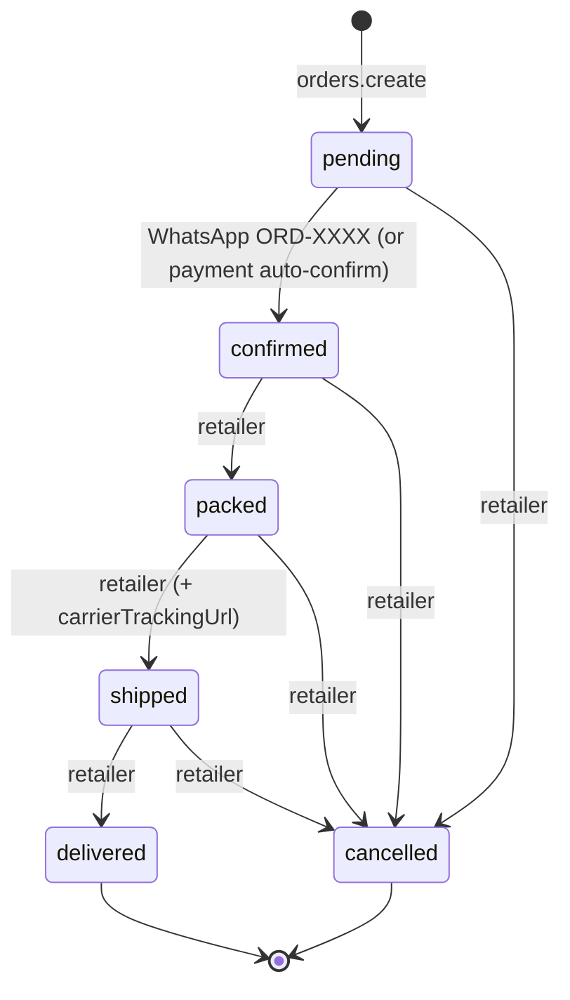
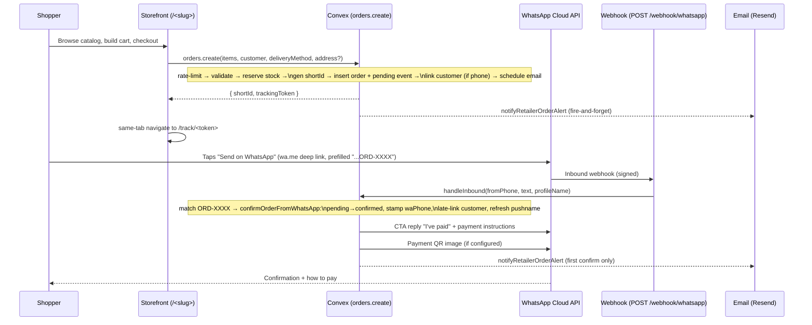

# Order Lifecycle

How an order is created, confirmed, and driven through fulfilment. Payment is a separate dimension — see [`payment-handshake.md`](./payment-handshake.md).

**Primary source files:**
- [`convex/orders.ts`](../convex/orders.ts) — mutations/queries (`create`, `updateStatus`, `updateDeliveryAddress`, …)
- [`convex/lib/order.ts`](../convex/lib/order.ts) — pure helpers (`generateShortId`, `computeOrderTotals`)
- [`convex/whatsapp.ts`](../convex/whatsapp.ts) — confirmation + status notifications
- [`convex/lib/whatsappCopy.ts`](../convex/lib/whatsappCopy.ts) — bilingual message rendering

## Fulfilment state machine

`status` lives on the `orders` row. The pipeline is **forward-flowing**, and `cancelled` is reachable from any non-terminal state.

```mermaid
stateDiagram-v2
    [*] --> pending: orders.create
    pending --> confirmed: WhatsApp ORD-XXXX (or payment auto-confirm)
    confirmed --> packed: retailer
    packed --> shipped: retailer (+ carrierTrackingUrl)
    shipped --> delivered: retailer
    pending --> cancelled: retailer
    confirmed --> cancelled: retailer
    packed --> cancelled: retailer
    shipped --> cancelled: retailer
    delivered --> [*]
    cancelled --> [*]
```

Notes:
- `orders.create` only ever produces `pending`. Validators in `updateStatus` (`transitionStatusValidator`) accept `confirmed | packed | shipped | delivered | cancelled` — `pending` is never a manual target.
- The transition graph is **not hard-enforced** in code beyond the validators — retailer-driven transitions trust the dashboard UI. The one server-enforced rule is around stock and aggregates on the *first* entry into `cancelled` (see below).

## End-to-end order flow

```mermaid
sequenceDiagram
    participant S as Shopper
    participant SF as Storefront (/<slug>)
    participant CX as Convex (orders.create)
    participant WA as WhatsApp Cloud API
    participant WH as Webhook (POST /webhook/whatsapp)
    participant EM as Email (Resend)

    S->>SF: Browse catalog, build cart, checkout
    SF->>CX: orders.create(items, customer, deliveryMethod, address?)
    Note over CX: rate-limit → validate → reserve stock →\ngen shortId → insert order + pending event →\nlink customer (if phone) → schedule email
    CX-->>SF: { shortId, trackingToken }
    CX-->>EM: notifyRetailerOrderAlert (fire-and-forget)
    SF->>SF: same-tab navigate to /track/<token>
    S->>WA: Taps "Send on WhatsApp" (wa.me deep link, prefilled "...ORD-XXXX")
    WA->>WH: Inbound webhook (signed)
    WH->>CX: handleInbound(fromPhone, text, profileName)
    Note over CX: match ORD-XXXX → confirmOrderFromWhatsApp:\npending→confirmed, stamp waPhone,\nlate-link customer, refresh pushname
    CX->>WA: CTA reply "I've paid" + payment instructions
    CX->>WA: Payment QR image (if configured)
    CX-->>EM: notifyRetailerOrderAlert (first confirm only)
    WA-->>S: Confirmation + how to pay
```

## `orders.create` — checkout

Public mutation (no auth — the storefront is anonymous). Steps, in order ([`convex/orders.ts`](../convex/orders.ts)):

1. **Rate limit first** — `orderCreate` keyed by `retailerId` (token bucket: burst 5, 30/min). Throttle before any DB reads. See [`validation-and-rate-limits.md`](./validation-and-rate-limits.md).
2. **Delivery-method invariant** — `delivery` requires `deliveryAddress`; `self_collect` forbids it. Default method is `delivery`.
3. **Address validation** — `assertValidAddress` (Malaysia-only) sanitizes and trims.
4. **Phone validation** — `assertValidMyMobile` if a phone was provided (MY-aware: a local `012-345 6789` normalizes to the `60…` form Meta delivers inbound, so the customer record can't fork). The storefront form **requires** the phone (86eyf1rck — the confirmation push needs a reachable number, gated client-side by the mirrored `myWaPhoneCheckoutSchema`; both require a MY **mobile** shape, since a landline can never receive WhatsApp); the arg stays optional at the protocol level so legacy callers/tests ride the old flow.
5. **Item validation** — 1–100 items. Each item names a **variant** by `variantId` (preferred) or a single-variant product's `productId` (resolved to its sole variant; ambiguous for multi-variant products → rejected). The variant + its parent product must belong to the retailer, both be `active`, and match the order currency. **Stock is enforced only when the variant hard-blocks** — `variant.blockWhenOutOfStock ?? product.blockWhenOutOfStock` resolves true. Made-to-order variants (frozen pack-to-order, metal prints, a "Custom" size) never block, even when a sibling variant in the same listing does. Quantities for the same variant across multiple line items are summed before the (conditional) `onHand` check. Each line snapshots `{productId, variantId, name, variantLabel, price, quantity}`.
6. **Compute totals** — `computeOrderTotals` (currently `total === subtotal`).
7. **Reserve stock** — for **hard-block variants only** (resolved per-variant), patch each variant's `onHand` down within the same transaction (atomic; rolls back on any failure). Variants are re-fetched fresh to avoid stale values. Made-to-order variants are never decremented.
8. **Collision-safe `shortId`** — up to 3 attempts via `generateShortId`; throws if all collide.
9. **Insert order** — `status: "confirmed"` when the **confirmation-push path is active** (buyer phone present AND `WHATSAPP_ORDER_CONFIRM_TEMPLATE` set — see the next section), else `status: "pending"`. Always writes a `pending` `orderEvents` row; the push path adds a `"Confirmed at checkout"` `confirmed` event and stamps `stampRetailerActivation` (the same milestone the legacy inbound-confirm path stamps).
10. **Early customer link** — if a phone is known, `linkOrderToCustomer` creates/updates the customer and stamps `customerId`. Phone-less orders are linked later (see confirmation).
11. **Fire-and-forget email** — schedule `notifyRetailerOrderAlert`.
12. **Confirmation push** (push path only) — schedule `whatsapp.notifyStorefrontOrderCreated` (see the next section).

Returns `{ shortId, trackingToken, confirmedAtCreate? }` — checkout navigates to `/track/<token>` **without** `?send=1` when `confirmedAtCreate` is true.

### The confirmation push — the order commits at "Place order" (86eyf1rck)

Since Meta's WhatsApp in-app browser rollout, a store link opened inside a
WhatsApp thread hits a "Continue to chat" interstitial when it tries to bounce
back via `wa.me` — buyers bail and the order strands as `pending` with no
phone. So the storefront no longer depends on the buyer's send at all:

- **Checkout requires a MY WhatsApp mobile number** ("Who's ordering?" card,
  echoed back formatted for typo-spotting, PDPA notice line beneath, EN/BM by
  store locale). Client gate `myWaPhoneCheckoutSchema` (`src/lib/schemas.ts`),
  server re-validates with `assertValidMyMobile` — the stricter sibling of
  `assertValidMyWaPhone` that also demands a MY **mobile** prefix, because a
  landline satisfies the 8–15-digit rule but can never receive WhatsApp.
- **Every storefront order takes this path** — including custom/made-to-order
  and fee-pending orders. What varies is push **timing** (86eyfq0w5): the
  approved template states "Total: {{3}}", so an order whose total isn't final
  yet (a price-on-quote line is RM 0.00 until quoted; a fee-pending total grows
  by the arranged fee) commits identically at create but its push is stamped
  **`deferred`** and fires once the price is confirmed — from the gate-open
  sites (mockup approve / waive / decline-with-remainder, `setDeliveryFee`),
  where it **replaces** the legacy free-form payment prompt (which a push-path
  buyer's window-less chat couldn't receive anyway). The chokepoint lives in
  `notifyStorefrontOrderCreated` itself: it refuses to send while EITHER hold
  (mockup gate, fee pending) is still open, so a doubly-held order sends
  exactly once, after both clear, without the sites coordinating; a cancelled
  order never sends. A custom-only order whose buyer declines the item is a
  cancellation — no confirmation ever exists. Legacy orders (env unset, buyer
  messaged first) keep the free-form `notifyPaymentDue` /
  `notifyDeliveryFeeSet` prompts unchanged.
- **The order inserts as `confirmed`** and Kedaipal's WABA pushes the
  confirmation — the Meta-approved **utility template**
  `order_confirmation_utility` (EN + BM variants; body params `shortId`,
  `storeName`, formatted total; the dynamic URL button carries the **tracking
  token** — its own parameter namespace, never a body slot). Sent by
  `whatsapp.notifyStorefrontOrderCreated` via
  `makeGuardedSender(ctx, retailerId, "transactional")`; the log row records
  category `utility_template` + the template name (per-template cost
  accounting for Meta's Oct-2026 per-message billing). This is the order's
  **one** outbound message — payment details stay on the order page
  (86ey98ju1 posture); the buyer's reply opens the free service window, from
  which point the seller's custom confirm template copy applies (noted inline
  in the Settings template editor).
- **A seller's custom `confirm` template override does NOT apply to the
  push** — template wording is fixed at Meta approval. Their copy takes over
  from the first in-window message onward.
- **Config switch:** `WHATSAPP_ORDER_CONFIRM_TEMPLATE` (Convex env; set to the
  approved template name). Unset ⇒ everything below this point degrades to the
  legacy `pending` + `?send=1` handoff — the code ships decoupled from Meta
  review. `retailers.getRetailerBySlug` exposes `confirmPushEnabled` so
  checkout copy is truthful pre-submit ("Place order" vs "Send order on
  WhatsApp").

**Outcome stamps** (`orders.confirmationPushStatus` / `confirmationPushAt` /
`confirmationPushWamid` / `confirmationPushFailureKind`):

- `"deferred"` — total not final at create (mockup quote / delivery fee
  outstanding); the push fires when the price is confirmed. Flips to
  `"sending"` only after the action's hold guards pass, so the buyer's page
  never claims "sending…" mid-negotiation.
- `"sending"` — stamped in the **same transaction as the insert** (or on a
  deferred push passing its guards), so the state is never ambiguous while
  attempts (including retries) are in flight. Without it, a confirmed order
  with no stamp is indistinguishable from one still sending, and the tracking
  page can't tell the buyer which.
- `"sent"` — Meta accepted the send; the wamid is stored because the
  **`statuses` webhook** (same `POST /webhook/whatsapp`, `value.statuses`)
  identifies messages only by it. A later `failed` event →
  `orders.markConfirmationPushFailed` (indexed probe on
  `by_confirmation_wamid`; no-ops for ordinary sends) flips it to `"failed"`
  with kind `unreachable` — Meta accepted then failed to *deliver*, which is
  the number, not us.
- `"failed"` — terminal, after retries. `confirmationPushFailureKind` records
  whose problem it is (see below).
- `"recovered"` — the buyer reached us anyway, by either repair route. Clears
  both the buyer card and the seller note.

**Retries — a blip must never become the buyer's job.** `notifyStorefrontOrderCreated`
takes a 1-based `attempt` and reschedules itself with backoff
(30s → 2m → 8m, `convex/lib/confirmationPush.ts`). The classifier is pure and
unit-tested, and splits three ways:

| Cause | Behaviour |
| --- | --- |
| No response / 5xx / 408 / 429 / throttle codes (130429, 131048, 131056, 80007) | Retry, then give up as `system` |
| Unreachable recipient (131026, 131030, 131047, 131051) | Terminal immediately, `unreachable` |
| Template problems (132000/132001/132005/132007/132012/132015/132016/…) | Terminal immediately, `system` |
| Any other 4xx | Terminal, `system` |

The load-bearing rule is the **double-send guard**: Meta exposes no idempotency
key, so we only retry when the evidence says nothing was delivered — a request
that never got a response, or a status Meta returns *instead of* accepting the
message. An ambiguous 2xx is never retried. An in-flight retry also re-reads the
order and bails if it's already `sent`/`recovered`.

**Two repair routes for a wrong number**, both funnelling through the shared
`customers.moveOrderToPhone` so they can't diverge (each moves the CRM
aggregates off the wrong record onto the right one):

1. **`orders.updateBuyerPhone`** (token capability, same trust model as
   `updateDeliveryAddress`) — the buyer corrects the number on their own order
   page; the push is re-queued from attempt 1. Gated to `failed` pushes only:
   there's no reason to rewrite a healthy order's number, and the narrow window
   means a leaked token can't quietly redirect a seller's order messages.
   Rate-limited (`buyerPhoneUpdate`) because every accepted save costs a send.
2. **Inbound ORD message** — `confirmOrderFromWhatsApp` treats an ORD ref sent
   to the shared number, for an order whose push *failed*, as proof of
   ownership and adopts the sender's number. Deliberately narrow: a healthy
   order's number is never overwritten by a forwarded message, and a
   late/replayed `failed` webhook never regresses `recovered`.

**Buyer-facing states** (`src/routes/track.$token.tsx`) — none of which gate the
page. The order is confirmed in every branch and the payment block stays
reachable: withholding a buyer's receipt because we couldn't send a *message*
would invert the point of the feature.

| State | What the buyer sees |
| --- | --- |
| `deferred` | Quiet "Order placed ✓ — we'll send your WhatsApp confirmation as soon as your price is confirmed." Nothing asked. |
| `sending` | Quiet "Sending your confirmation to +60 …" line. Nothing asked. |
| `sent` | "Order placed ✓ — confirmation sent to your WhatsApp" + optional open-chat anchor. **No auto-redirect anywhere on this path.** |
| `failed` + `unreachable` | Amber card naming the number, **"Update my number"** (saves → re-sends), plus a quiet "or message us" link. |
| `failed` + `system` | Amber card stating it's our fault, the order is confirmed, and they can still pay. **No action demanded.** |
| `recovered` | Nothing. |

The seller's order detail mirrors the same split, so a system fault never sends
them chasing a customer whose number was fine.

`orders.get` serves `checkoutPhone` while `pending` **or** whenever a push stamp
exists (the anchor + repair routes need the wa.me target).

### The WhatsApp handoff — the legacy / fallback path

Everything in this section is now the **fallback**: it runs when the push path
is inactive (template env unset, or a rare phone-less direct create) and as
the **recovery surface** for failed pushes and legacy pending orders. The
mechanics are unchanged:

The storefront checkout **does not** open `wa.me` itself. `window.open` after
the awaited `orders.create` round-trip falls outside the submit tap's
_transient user activation_, so popup blockers — iOS Safari and the
Instagram/Facebook in-app webviews where WhatsApp-driven buyers actually
browse — silently swallow the tab: the order exists, but the buyer is
stranded on the storefront and their phone number is never captured (the
`wa.me` message is how the bot learns it). This shipped as a production
incident before the current design.

Instead, checkout **same-tab navigates to the tracking page**
(`/track/<trackingToken>` — navigation is never popup-blocked). While the
order is `pending`, the tracking page leads with a **"Send your order on
WhatsApp"** card ([`src/routes/track.$token.tsx`](../src/routes/track.$token.tsx)):

- The CTA is a plain **anchor** to the `wa.me` deep link — tapping it is a
  fresh user gesture, which browsers always allow.
- A **copy-link fallback** covers webviews that refuse to open WhatsApp at
  all (the buyer pastes it into a real browser). Inside **WhatsApp's own
  in-app browser** (`isWhatsAppWebview`, UA sniff) the row instead copies the
  **order message body** ("Copy order message") — a `wa.me` link is exactly
  what just failed there; the buyer pastes the message straight into the chat
  they came from. EN/BM.
- The message is **rebuilt from the order's frozen snapshot** on every render
  (`src/lib/wa-order-message.ts` — items, address/pickup, note, fulfilment
  date), so the handoff survives refreshes and lost sessions, and doubles as
  recovery for any pending order where the buyer bailed before sending.
- `orders.get` serves `checkoutPhone` (same `WHATSAPP_CHECKOUT_PHONE` →
  `retailers.waPhone` fallback as the storefront) while the order is
  `pending` **or carries any `confirmationPushStatus`** (the push-path
  success anchor + failed-push recovery card need the wa.me target); the
  cards themselves gate on status + push state. Counter orders are created
  `confirmed` with no push stamp (buyer binds via QR scan) and never see it.

**Auto-fire on arrival (`?send=1`):** checkout navigates to
`/track/<token>?send=1`, and the card **auto-triggers the handoff** so the
buyer still reaches WhatsApp without an extra tap (desktop keeps its old
one-click feel; mobile finally gets it). The button starts as
"Opening WhatsApp…" (loading), and after a short paint delay the page
**same-tab navigates** (`window.location.assign`) to the `wa.me` link —
same-tab navigation is never popup-blocked. The timing lives in the
framework-free [`src/lib/wa-auto-open.ts`](../src/lib/wa-auto-open.ts)
(unit-tested): if the page is still there after a 4s watchdog (a webview
refused to leave), loading settles back to the manual button + copy-link
fallback. The search param is **stripped (history replace) before
navigating away**, and returning from WhatsApp (bfcache `pageshow` /
`visibilitychange`) also settles the button — so refresh or back never
re-fires the redirect or leaves the button stuck loading. Only checkout
sets `?send=1`; organic visits to a pending order get the manual card
unchanged. **Inside WhatsApp's in-app browser the auto-fire is skipped
entirely** (`isWhatsAppWebview` — the redirect would bounce the buyer into a
"Continue to chat" interstitial while they're already in WhatsApp); the
manual button renders immediately and `?send=1` is still consumed.

## WhatsApp confirmation

Inbound flow lives in [`convex/whatsapp.ts`](../convex/whatsapp.ts), entered from the webhook (`POST /webhook/whatsapp`, signature-verified — see [`whatsapp-webhook-security.md`](./whatsapp-webhook-security.md)).

- `handleInbound` matches `SHORT_ID_REGEX` against the message text.
  - **No match** → friendly English fallback ("To place an order, browse our catalog…").
  - **Match** → `confirmOrderFromWhatsApp`.
- `confirmOrderFromWhatsApp` (internal mutation) is **idempotent**:
  - If `pending`, transitions to `confirmed` and writes a `"Confirmed via WhatsApp"` event.
  - Stamps `order.customer.waPhone` if it was empty (link-in-bio backfill).
  - **Failed-push recovery (86eyf1rck)** — if the order's
    `confirmationPushStatus` is `"failed"`, the inbound ORD ref proves the
    sender owns the order: their number **replaces** the typo'd checkout
    number, the customer record is relinked (old aggregates decremented), and
    the status flips to `"recovered"`. Only a failed push unlocks this — a
    healthy order's number is never overwritten.
  - **Late customer link** — if `customerId` is still null, normalizes the phone and calls `linkOrderToCustomer`. Orders already linked at checkout are skipped (no double counting).
  - Refreshes the customer's `waProfileName` from the sender's pushname (never clobbers a retailer-edited `name`).
- The reply is rendered in the retailer's locale (`en`/`ms`) and sent as a **CTA message** ("I've paid" button → tracking page). It degrades to plain text when interactive buttons aren't available (e.g. non-HTTPS `APP_URL` in dev). A **hard-coded, non-overridable** transfer-reference line is always appended (see [`payment-handshake.md`](./payment-handshake.md#transfer-reference)). A payment QR is sent as a follow-up image if configured.

## `orders.updateStatus` — retailer transitions

Auth-gated (Clerk); ownership checked (`retailer.userId === identity.subject`). Behaviour:

- **Mockup gate** — a `→ packed` transition is **rejected** for a mockup-required order (`mockupStatus !== undefined`) unless `mockupStatus === "approved"` or the seller has waived it (`mockupWaivedAt` set). An order is mockup-required when **≥1 line's variant** resolves `requiresProof` true (per-variant override ?? product default), stamped at create time. Production can't start before the buyer signs off (or the seller deliberately proceeds). Cancellation is never gated. See [`proof-approval.md`](./proof-approval.md).
- **Stock restoration on cancel** — only on the *first* transition into `cancelled` (idempotent). Quantities are re-summed per **variant** and added back to `onHand`, but **only for variants that hard-block** (resolved per-variant; made-to-order variants were never decremented, so nothing to restore). Deleted variants and legacy items without a `variantId` are skipped.
- **Customer aggregate decrement on cancel** — same first-transition guard; reverses this order's contribution via `decrementAggregatesForCancel` (floors at zero).
- **Carrier tracking URL** — accepted only when `status === "shipped"` (trimmed, non-empty). `setCarrierTrackingUrl` is a separate mutation for setting/clearing it later, intentionally not status-restricted.
- **Audit** — every transition writes an `orderEvents` row.
- **Notification** — schedules `notifyStatusChange` (fire-and-forget). It no-ops for `pending`/`confirmed` (those are covered by the confirmation flow) and when the order has no `customerWaPhone`. Messages are localized; `shipped` includes the carrier URL when set.

## Hard delete — permanent erase (`deleteOrder` / `bulkDeleteOrders`)

Separate from cancellation. **Cancel** keeps the row (a terminal `cancelled`
status, buyer notified). **Hard delete** erases the order and everything derived
from it, leaving no tombstone — for test / spam / duplicate orders that need to
disappear. **Kedaipal admin only** (support): both mutations resolve
`requireOrderAccess`/`requireRetailerAccess` and then throw `Forbidden` unless
the caller **is an admin** (`isAdmin` — allow-list membership, checked directly),
so a plain store owner — Starter, Pro or Scale — is rejected server-side even
though they own the store. The gate is admin membership, **not**
`access.actingAsAdmin`: an admin can erase orders in **any** store, including one
they personally own (which resolves via `requireRetailerAccess`'s owner branch,
where `actingAsAdmin` is `false` — the earlier `actingAsAdmin` guard wrongly
blocked that case). An admin erase on a store they **don't** own drops an
`adminAuditLog` row (action `orders.hardDelete` / `orders.bulkDeleteOrders`) —
that's the white-glove trail `logAdminAction` records; an admin erasing their own
store's order is an owner write and isn't audited. ClickUp `86ey8fr8t` (the
erase), `86eyaqzpd` (admin-only restriction).

**Why admin-only:** a hard delete is irreversible (no tombstone) and wipes
invoice / receipt / revenue-driving data. Leaving it in seller hands meant a
disputed or fat-fingered order could vanish with no oversight and no audit row
(owner writes aren't audited). Sellers keep **Cancel** — tombstoned and buyer-
notified — as their way to make an order go away; permanent erasure sits with
Kedaipal.

**It is silent** — unlike cancel, NO WhatsApp/email is sent. (That's the reason
delete isn't "cancel-then-remove": you don't want to ping the buyer of a junk
order.)

The cascade lives in `deleteOrderCascade` (shared by both mutations so single and
bulk can't drift):

1. **Reverse the create-time effects — but only if the order isn't already
   `cancelled`.** A live order still counts toward stock reservations, the
   customer's lifetime aggregates, and the monthly usage meter, so deleting it
   runs `reverseCancellationEffects` (restore hard-block stock, decrement
   customer `orderCount`/`totalSpent`, un-meter usage from its **creation**
   month). A `cancelled` order **already** had this applied on the way into
   `cancelled` — re-running would double-count, so it's skipped. This guard is
   the one real correctness trap; `reverseCancellationEffects` is the same helper
   `applyStatusTransition` uses, extracted so the two paths share it.
2. **Delete owned storage blobs** — buyer reference image, payment proof, and
   mockup image(s) (`mockupImageStorageIds ?? [mockupImageStorageId]`, deduped;
   per-blob errors swallowed — a missing blob mustn't abort). Order
   receipt/invoice PDFs are generated on demand and never persisted, so there's
   nothing to reclaim there. Subscription invoices are billing artefacts tied to
   `subscriptions`, **not** orders — untouched.
3. **Delete the `orderEvents` timeline** (`by_order` index).
4. **Unlink any counter-checkout session** that spawned the order (new
   `counterCheckoutSessions.by_order` index → set `orderId: undefined`; the
   session is ephemeral and purged on its own cron, so we just drop the dangling
   ref rather than delete it).
5. **Delete the order row.**

Scheduled jobs that reference orders (e.g. the payment-reminder cron) already
no-op on a missing order, so a delete between schedule and fire is safe.

**Access / tiering:** both `deleteOrder` and `bulkDeleteOrders` are **admin
only** (any store), not plan-gated — permanent erasure is an ops action, not a
paid feature, so it applies equally to Starter / Pro / Scale. (The bulk
mutation's earlier Pro `orderInbox` gate is gone: a plain owner never reaches it,
they're rejected up front.) Bulk checks the admin gate once up front (`isAdmin` —
one caller identity for the batch), then still caps at 100/batch and resolves
each order's retailer per row (for the audit context + retailer-existence check),
so a stale client can't sneak an erase through mid-flow.

**UI (hidden, not just disabled):** the "Delete permanently" danger action in the
order-detail More-actions section and the "Delete permanently" item in the inbox
bulk bar **render only under an admin act-as session** (`retailer.actingAsAdmin`);
a plain seller never sees either — there's no confusion about what they can undo.
`getRetailerForAdmin` sets `actingAsAdmin: true` for *any* act-as target, so an
admin sees the action even when acting-as a store they own — matching the
server's ownership-agnostic gate. The server guard, not the hidden UI, is the
real boundary. Under act-as the
actions work as before: each behind its own confirm dialog, making clear the
buyer is NOT notified and it can't be undone (with an extra warning when the order
is paid/delivered — it'll vanish from CSV/revenue records). On the order-detail
page the More-actions panel collapses on desktop for a terminal order in a plain
seller session (Cancel gone, Delete hidden, receipt lives in the header), so it
never opens to an empty divider.

**Type-to-confirm safety gate:** because this is the one irreversible action in
the dashboard, both delete confirm dialogs pass `confirmPhrase="DELETE"` to the
shared `ConfirmDialog` — the destructive button stays disabled until the user
*types* `DELETE`. Input is auto-uppercased (type `delete`, box reads `DELETE`)
and paste / drag-drop / autofill are blocked, so confirming is a deliberate
keystroke action, not a reflex click or a paste. The phrase box resets on every
open; a failed mutation keeps the dialog open with the phrase intact so the user
can simply re-click. This gate is scoped to permanent delete only — cancel,
mark-paid, and every other `ConfirmDialog` stay one-click. (ClickUp `86ey9xje6`.)

## Public shopper mutations (capability = `trackingToken`)

Trust model: knowing the high-entropy `orders.trackingToken` is the capability — anyone with the tracking link (`/track/<token>`) can act. The human `shortId` is NOT a secret. Each is rate-limited per `token`. See [`infra-cost-scaling.md` §6](./infra-cost-scaling.md).

- **`updateDeliveryAddress`** — only while `pending` (locked after confirmation); rejected for `self_collect`. Writes an `"address_updated"` event.
- **Payment mutations** (`claimPayment`, `generateOrderProofUploadUrl`) — see [`payment-handshake.md`](./payment-handshake.md).

**Contact the store:** the tracking page shows a "Message {store}" CTA that opens a `wa.me` chat to the **vendor's own** number (`retailers.waPhone`) with the order ref pre-filled — buyers otherwise only ever hear from the shared Kedaipal WABA. Surfaced via `orders.get` (`retailerWaPhone` + `storeName`); hidden when the vendor has no number set.

## `shortId` design

`ORD-` + 4 chars from `ABCDEFGHJKLMNPQRSTUVWXYZ23456789` ([`convex/lib/order.ts`](../convex/lib/order.ts)). The alphabet **excludes `O`, `0`, `I`, `1`** so shoppers can't mistype it when copying the transfer reference into their banking app. ~1M combinations; collisions handled by the 3-retry loop in `create`.
