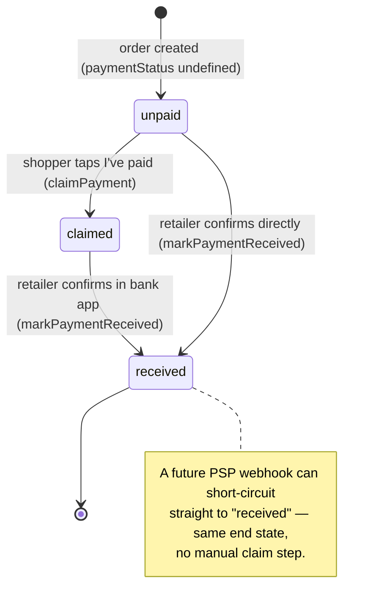

# Payment Handshake

The manual, two-button payment confirmation flow. **Shipped and in production** — this is the canonical reference for how it behaves today. For the original design rationale (problem framing, why we deferred it, future PSP swap-in), see [`payment-handshake-roadmap.md`](./payment-handshake-roadmap.md).

No payment gateway is involved: this solves the "did the money land?" handshake on top of the bank-transfer / DuitNow QR flow retailers already use. Customer payment money never touches Kedaipal — the retailer owns the gateway/bank account.

**Source files:** [`convex/orders.ts`](../convex/orders.ts) (`claimPayment`, `markPaymentReceived`, `generateOrderProofUploadUrl`, `getPaymentProofUrl`), [`convex/schema.ts`](../convex/schema.ts) (payment fields), [`convex/whatsapp.ts`](../convex/whatsapp.ts) (`notifyPaymentReceived`).

## Payment is independent of fulfilment

An order has two orthogonal dimensions. `paymentStatus` does **not** gate the fulfilment `status` pipeline (see [`order-lifecycle.md`](./order-lifecycle.md)) — the only coupling is the auto-confirm convenience below.



`paymentStatus` is **optional**; `undefined` is treated as `unpaid`. Indexed by `by_retailer_payment` for dashboard filtering.

## Shopper flow — claim payment

On the tracking page (`/track/<token>`), the shopper taps **"I've paid"**. Trust model: knowing the high-entropy `orders.trackingToken` is the capability (the human `shortId` is NOT a secret — see [`infra-cost-scaling.md` §6](./infra-cost-scaling.md)).

1. **(Optional) attach a screenshot** — `generateOrderProofUploadUrl(token)` mints a one-shot Convex storage upload URL. Rate-limited `proofUpload` (3/min per token). Refused once `received`.
2. **`claimPayment(shortId, reference?, proofStorageId?)`** — rate-limited `paymentClaim` (5/min per shortId):
   - Rejected only if already `received` ("Payment already confirmed") — a retailer-confirmed payment can't be re-claimed.
   - **Idempotent otherwise**: re-submitting overwrites `paymentReference` / `paymentProofStorageId` and refreshes `paymentClaimedAt`. This lets a shopper fix a typo'd reference or add a screenshot they forgot.
   - `reference` is trimmed and capped at **80 characters** (`PAYMENT_REFERENCE_MAX`).
   - Sets `paymentStatus: "claimed"`, writes a `"payment_claimed"` `orderEvents` row.
   - Schedules `notifyPaymentClaimed` email to the retailer (fire-and-forget).

## Retailer flow — mark received

In the dashboard, the retailer reviews the claimed reference + proof screenshot (`getPaymentProofUrl` — **auth-gated**, ownership-checked, so shoppers can't fish proof images for arbitrary shortIds) and clicks **"Mark payment received"**.

**`markPaymentReceived(orderId, note?)`** — auth-gated, ownership-checked:
- **Idempotent** — if already `received`, returns immediately (no-op second click).
- Sets `paymentStatus: "received"` + `paymentReceivedAt`.
- **Auto-confirm**: if the order is still `pending`, it bumps `status → confirmed` in the same transaction and writes a `"payment_received_auto_confirm"` event. Otherwise it writes a `"payment_received"` event (optionally suffixed with the retailer's note).
- Schedules `notifyPaymentReceived` (WhatsApp). This **bypasses** the normal `notifyStatusChange` path so that an auto-confirm doesn't send two messages — the shopper gets one "✅ Payment received…" message.

## Transfer reference

Every order-confirmation WhatsApp reply appends a **hard-coded, non-overridable** line instructing the shopper to use `ORD-XXXX` as their bank-transfer reference (`renderSystemMessage(locale, "transferReferenceLine", …)` in [`convex/whatsapp.ts`](../convex/whatsapp.ts)).

This bypasses retailer-customised `messageTemplates` deliberately: the order ID in the transfer reference is the **only deterministic way** a retailer can match an incoming bank notification to an order when reconciling in bulk. Removing it would break manual reconciliation, so it is always present. The `shortId` alphabet excludes ambiguous characters precisely so it survives being typed into a banking app — see [`order-lifecycle.md`](./order-lifecycle.md#shortid-design).

## Payment methods (multi-method)

A retailer configures **N payment methods** (`retailers.paymentMethods`), each a `bank` or a `qr`, with a label, the relevant fields, a note, and a sort order. Established sellers run several banks (Maybank + CIMB) and QRs (DuitNow, TNG); more ways to pay = faster confirmation. Capped at 8.

```ts
paymentMethods?: Array<{
  type: "bank" | "qr";
  label: string;            // "Maybank", "DuitNow QR" — bold heading on the order page
  bankName?, bankAccountName?, bankAccountNumber?;   // bank
  qrImageStorageId?;        // qr (Convex storage id)
  note?; sortOrder;
}>
```

**Single source of truth** — `convex/lib/payment.ts` (pure, tested):
- `resolvePaymentMethods(retailer)` — prefers the array (sorted), else synthesizes methods from the legacy single object. Used by the track query, the settings read, and the WA flow (only to know whether the seller has ≥1 method — see rendering below).
- `legacyToPaymentMethods(legacy)` — legacy `{bank…, qr, note}` → up to two methods.
- `sanitizePaymentMethods(input)` — trims, caps, drops-empty, re-numbers `sortOrder`.

**Migration (widen → backfill → narrow):** the legacy single `paymentInstructions` object stays in the schema and is still **read** (via the resolver), so un-migrated rows keep working. Saving via the multi-method settings UI writes `paymentMethods` and **clears** the legacy object. `retailers.backfillPaymentMethods` (internal, dev) migrates the rest; dropping the legacy field is a later narrow.

**QR storage GC:** `updateSettings` diffs the retailer's previously-referenced QR storage ids (`collectQrStorageIds` — array + legacy) against the incoming set and `ctx.storage.delete`s the ones no longer referenced (best-effort). This covers replace, "Remove QR", and method deletion — so editing payment methods doesn't leak orphaned blobs. Account deletion deletes all QR blobs the same way.

**Rendering:**
- **WhatsApp payment message** — raw bank details and QR images are **never sent in the chat** (ticket 86ey98ju1 — friction + a copyable account number sitting in chat history is a security/compliance surface). Instead `renderPaymentCta(locale, trackingUrl, hasPaymentMethods)` appends a short **"💳 Payment details — see how to pay and confirm your payment on your order page 👇"** block with the tracking URL (embedded as text so it survives a text-only fallback, and is also the **"Make payment"** CTA button target — the button opens the order page where "How to pay" + the "I've paid" confirm live). Rendered only when the seller has ≥1 configured method (nothing to point at otherwise). The seller manages payment info from the dashboard; the chat only links to it.
- **Track page** — the actual details live here: a "How to pay" section (`track.$token.tsx`) iterates the methods (bank cards + QR images) with a **one-tap `CopyButton`** on each account number (`src/components/ui/copy-button.tsx` — reusable, check-mark + toast, degrades when the Clipboard API is unavailable). Backed by the public `orders.getPaymentMethods({ token })` query (capability = tracking token; legacy-aware, resolves QR URLs, `null` when none). Shown while payment is still due (`paymentStatus !== "received"`) and not deferred behind a closed mockup gate.
- **Settings** (`app.settings.tsx`) — a repeatable editor with **two groups** (Bank accounts, QR codes), each independently **drag-to-reorder**. The array order == the order buyers see the methods in on their order page's "How to pay". On save the array is flattened banks-then-QRs with sequential `sortOrder`. The reorder uses the shared **`SortableList`** (`src/components/ui/sortable-list.tsx`) — a reusable @dnd-kit primitive: mobile-safe sensors (`useSortableSensors`: 250 ms touch long-press + `touch-none` grip so the page still scrolls); rows **collapse to a compact one-line form while dragging** (via the `state.isSorting` flag) so a tall list stays easy to rearrange; and the moving card renders in a **`DragOverlay`** so it tracks the cursor independently of the list reflow. Use it for all future drag-to-reorder surfaces.

> **Why the order page, not the chat (86ey98ju1):** bank digits pasted into WhatsApp are copyable, forwardable, and linger in chat history. Moving them behind the capability-secured tracking page keeps the sensitive data on a managed surface (with one-tap copy) while the chat still gets the buyer there in one tap. A residual exposure is called out below.

> One-tap copy is scoped to the **bank account number** (the value shoppers paste into their banking app, where an exact copy matters). Source: Sukhjeet / Metalpix beta + prospect call.

> **Residual: the counter invoice PDF.** For a counter pay-later order, `notifyCounterOrderCreated` still sends an **invoice PDF** to the buyer's WhatsApp whose "How to pay" block carries the bank details (see [`invoices-receipts.md`](./invoices-receipts.md)). This is a **formal financial document** where payment details conventionally belong, and it's not "raw digits pasted in chat", so it's kept out of scope for 86ey98ju1. If a fully-clean-of-bank-details WhatsApp channel is required, swap the PDF's how-to-pay block for a "pay online: `<trackingUrl>`" line as a follow-up.

## Notification summary

| Event | Trigger | Channel | Recipient |
|---|---|---|---|
| Payment claimed | `claimPayment` | Email | Retailer ("verify in your bank") |
| Payment received | `markPaymentReceived` | WhatsApp | Shopper ("✅ Payment received…") |

## Payment method (`order.paymentMethod`)

Separate from `paymentStatus` (the handshake state) and from the retailer's payout
config (`lib/payment.ts`): a structured tag of **how the buyer settled** —
`cash | duitnow | tng | bank_transfer | card | other` (`convex/lib/paymentMethod.ts`).
Captured **only where reliably known** — Counter Checkout "Paid now," and an
optional chip on the seller's "mark payment received" dialog (they've just verified
the channel). The buyer's "I've paid" self-claim never sets it, so online orders
stay `undefined` = online/unknown. **Filterable on the orders inbox** (the
"Method" chips, wired through `searchOrders`'s `paymentMethods` arg); an order with
no method matches no method filter. Drives future analytics on reliable data
without adding buyer friction. See [`counter-checkout.md`](./counter-checkout.md).

## Future: PSP swap-in

The schema and notification slots are shaped for a gateway integration (HitPay Connect / Billplz / Stripe Connect). Adding it means flipping `paymentStatus` to `received` from a PSP webhook instead of the manual button — the end state and downstream messaging are identical. See [`payment-handshake-roadmap.md`](./payment-handshake-roadmap.md) and the customer-payment-gateway roadmap item in [`CLAUDE.md`](../CLAUDE.md).
