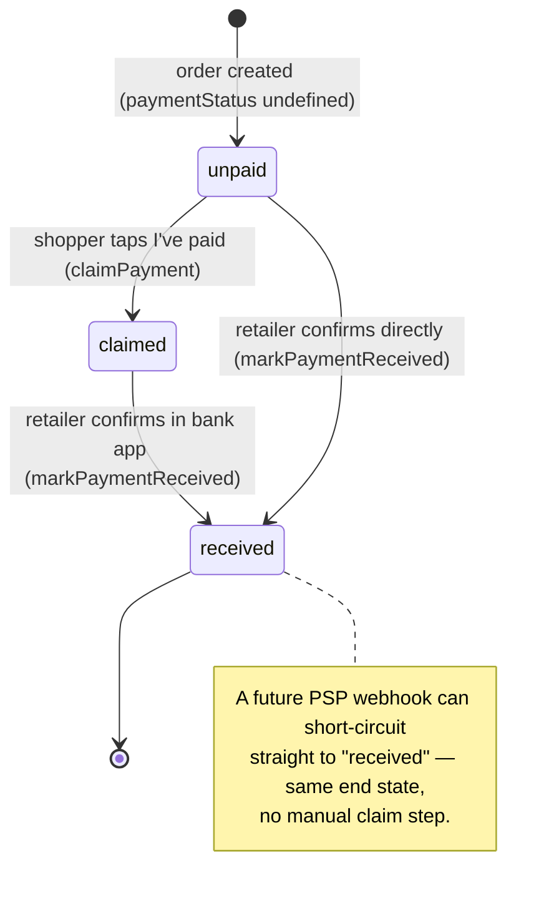

# Payment Handshake

The manual, two-button payment confirmation flow. **Shipped and in production** — this is the canonical reference for how it behaves today. For the original design rationale (problem framing, why we deferred it, future PSP swap-in), see [`payment-handshake-roadmap.md`](./payment-handshake-roadmap.md).

No payment gateway is involved: this solves the "did the money land?" handshake on top of the bank-transfer / DuitNow QR flow retailers already use. Customer payment money never touches Kedaipal — the retailer owns the gateway/bank account.

**Source files:** [`convex/orders.ts`](../convex/orders.ts) (`claimPayment`, `markPaymentReceived`, `generateOrderProofUploadUrl`, `getPaymentProofUrl`), [`convex/schema.ts`](../convex/schema.ts) (payment fields), [`convex/whatsapp.ts`](../convex/whatsapp.ts) (`notifyPaymentReceived`).

## Payment is independent of fulfilment

An order has two orthogonal dimensions. `paymentStatus` does **not** gate the fulfilment `status` pipeline (see [`order-lifecycle.md`](./order-lifecycle.md)) — the only coupling is the auto-confirm convenience below.



`paymentStatus` is **optional**; `undefined` is treated as `unpaid`. Indexed by `by_retailer_payment` for dashboard filtering.

## Shopper flow — claim payment

On the tracking page (`/track/<shortId>`), the shopper taps **"I've paid"**. Trust model: knowing the `shortId` is the capability (same as the rest of the public tracking surface).

1. **(Optional) attach a screenshot** — `generateOrderProofUploadUrl(shortId)` mints a one-shot Convex storage upload URL. Rate-limited `proofUpload` (3/min per shortId). Refused once `received`.
2. **`claimPayment(shortId, reference?, proofStorageId?)`** — rate-limited `paymentClaim` (5/min per shortId):
   - Rejected only if already `received` ("Payment already confirmed") — a retailer-confirmed payment can't be re-claimed.
   - **Idempotent otherwise**: re-submitting overwrites `paymentReference` / `paymentProofStorageId` and refreshes `paymentClaimedAt`. This lets a shopper fix a typo'd reference or add a screenshot they forgot.
   - `reference` is trimmed and capped at **80 characters** (`PAYMENT_REFERENCE_MAX`).
   - Sets `paymentStatus: "claimed"`, writes a `"payment_claimed"` `orderEvents` row.
   - Schedules `notifyPaymentClaimed` email to the retailer (fire-and-forget).

## Retailer flow — mark received

In the dashboard, the retailer reviews the claimed reference + proof screenshot (`getPaymentProofUrl` — **auth-gated**, ownership-checked, so shoppers can't fish proof images for arbitrary shortIds) and clicks **"Mark payment received"**.

**`markPaymentReceived(orderId, note?)`** — auth-gated, ownership-checked:
- **Idempotent** — if already `received`, returns immediately (no-op second click).
- Sets `paymentStatus: "received"` + `paymentReceivedAt`.
- **Auto-confirm**: if the order is still `pending`, it bumps `status → confirmed` in the same transaction and writes a `"payment_received_auto_confirm"` event. Otherwise it writes a `"payment_received"` event (optionally suffixed with the retailer's note).
- Schedules `notifyPaymentReceived` (WhatsApp). This **bypasses** the normal `notifyStatusChange` path so that an auto-confirm doesn't send two messages — the shopper gets one "✅ Payment received…" message.

## Transfer reference

Every order-confirmation WhatsApp reply appends a **hard-coded, non-overridable** line instructing the shopper to use `ORD-XXXX` as their bank-transfer reference (`renderSystemMessage(locale, "transferReferenceLine", …)` in [`convex/whatsapp.ts`](../convex/whatsapp.ts)).

This bypasses retailer-customised `messageTemplates` deliberately: the order ID in the transfer reference is the **only deterministic way** a retailer can match an incoming bank notification to an order when reconciling in bulk. Removing it would break manual reconciliation, so it is always present. The `shortId` alphabet excludes ambiguous characters precisely so it survives being typed into a banking app — see [`order-lifecycle.md`](./order-lifecycle.md#shortid-design).

## Payment methods (multi-method)

A retailer configures **N payment methods** (`retailers.paymentMethods`), each a `bank` or a `qr`, with a label, the relevant fields, a note, and a sort order. Established sellers run several banks (Maybank + CIMB) and QRs (DuitNow, TNG); more ways to pay = faster confirmation. Capped at 8.

```ts
paymentMethods?: Array<{
  type: "bank" | "qr";
  label: string;            // "Maybank", "DuitNow QR" — bold heading in the WA reply
  bankName?, bankAccountName?, bankAccountNumber?;   // bank
  qrImageStorageId?;        // qr (Convex storage id)
  note?; sortOrder;
}>
```

**Single source of truth** — `convex/lib/payment.ts` (pure, tested):
- `resolvePaymentMethods(retailer)` — prefers the array (sorted), else synthesizes methods from the legacy single object. Used by the WA reply, the track query, and the settings read.
- `legacyToPaymentMethods(legacy)` — legacy `{bank…, qr, note}` → up to two methods.
- `sanitizePaymentMethods(input)` — trims, caps, drops-empty, re-numbers `sortOrder`.

**Migration (widen → backfill → narrow):** the legacy single `paymentInstructions` object stays in the schema and is still **read** (via the resolver), so un-migrated rows keep working. Saving via the multi-method settings UI writes `paymentMethods` and **clears** the legacy object. `retailers.backfillPaymentMethods` (internal, dev) migrates the rest; dropping the legacy field is a later narrow.

**Rendering:**
- **WhatsApp confirm reply** — `renderPaymentMethods(locale, methods)` lists every bank method as a labelled (`*bold*`) sub-block with the **account number on its own line** (so a long-press selects just the number); each `qr` method is sent as a **separate follow-up image**, captioned with its label.
- **Track page** — a "How to pay" section (`track.$shortId.tsx`) iterates the methods (bank cards + QR images) with a **one-tap `CopyButton`** on each account number (`src/components/ui/copy-button.tsx` — reusable, check-mark + toast, degrades when the Clipboard API is unavailable). Backed by the public `orders.getPaymentMethods({ shortId })` query (capability = shortId; legacy-aware, resolves QR URLs, `null` when none). Shown while payment is still due (`paymentStatus !== "received"`) and not deferred behind a closed mockup gate.
- **Settings** (`app.settings.tsx`) — a repeatable editor with **two groups** (Bank accounts, QR codes), each independently **drag-to-reorder**. Grouping is intentional: banks render together in the WA text block while each QR is a *separate image message*, so cross-type order has no visible effect in WhatsApp — sorting "my banks" / "my QRs" is what actually renders. On save the array is flattened banks-then-QRs with sequential `sortOrder`. The reorder uses the shared **`SortableList`** (`src/components/ui/sortable-list.tsx`) — a reusable @dnd-kit primitive with a mobile-safe sensor set (`useSortableSensors`: 250 ms touch long-press + `touch-none` grip handle so the page still scrolls). Use it for all future drag-to-reorder surfaces.

> One-tap copy is scoped to the **bank account number** (the value shoppers paste into their banking app, where an exact copy matters). Source: Sukhjeet / Metalpix beta + prospect call.

## Notification summary

| Event | Trigger | Channel | Recipient |
|---|---|---|---|
| Payment claimed | `claimPayment` | Email | Retailer ("verify in your bank") |
| Payment received | `markPaymentReceived` | WhatsApp | Shopper ("✅ Payment received…") |

## Future: PSP swap-in

The schema and notification slots are shaped for a gateway integration (HitPay Connect / Billplz / Stripe Connect). Adding it means flipping `paymentStatus` to `received` from a PSP webhook instead of the manual button — the end state and downstream messaging are identical. See [`payment-handshake-roadmap.md`](./payment-handshake-roadmap.md) and the customer-payment-gateway roadmap item in [`CLAUDE.md`](../CLAUDE.md).
