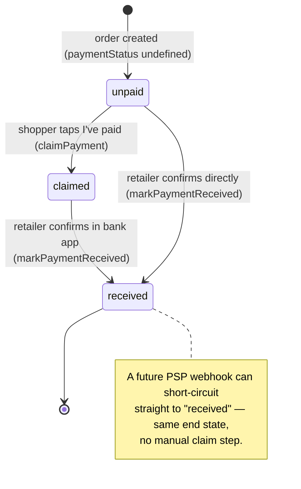

# Payment Handshake

The manual, two-button payment confirmation flow. **Shipped and in production** — this is the canonical reference for how it behaves today. For the original design rationale (problem framing, why we deferred it, future PSP swap-in), see [`payment-handshake-roadmap.md`](./payment-handshake-roadmap.md).

No payment gateway is involved: this solves the "did the money land?" handshake on top of the bank-transfer / DuitNow QR flow retailers already use. Customer payment money never touches Kedaipal — the retailer owns the gateway/bank account.

**Source files:** [`convex/orders.ts`](../convex/orders.ts) (`claimPayment`, `markPaymentReceived`, `generateOrderProofUploadUrl`, `listPaymentProofs`), [`convex/lib/paymentClaims.ts`](../convex/lib/paymentClaims.ts) (submission history), [`convex/schema.ts`](../convex/schema.ts) (payment fields + `paymentClaims`), [`src/components/order/payment-proof-list.tsx`](../src/components/order/payment-proof-list.tsx) (the seller's proof card), [`src/routes/track.$token.tsx`](../src/routes/track.$token.tsx) (both buyer-facing halves of the handshake).

> **The handshake no longer sends anything (2026-08-04, [`86eyd63r8`](https://app.clickup.com/t/86eyd63r8)).**
> `whatsapp.notifyPaymentReceived` — the "✅ Payment received" WhatsApp — is
> deleted, along with the day-11 and manual payment reminders. The buttons, the
> states and the audit trail are all unchanged; what changed is that the buyer
> learns the outcome on their **order page**, live, instead of by message. The
> page is reactive, so a buyer sitting on it sees the flip the instant the seller
> taps Confirm. See [`one-message-per-order.md`](./one-message-per-order.md) and
> [`payment-reminder.md`](./payment-reminder.md).

## Payment is independent of fulfilment

An order has two orthogonal dimensions. `paymentStatus` does **not** gate the fulfilment `status` pipeline (see [`order-lifecycle.md`](./order-lifecycle.md)) — the only coupling is the auto-confirm convenience below.


```mermaid
stateDiagram-v2
    [*] --> unpaid: order created (paymentStatus undefined)
    unpaid --> claimed: shopper taps I've paid (claimPayment)
    claimed --> received: retailer confirms in bank app (markPaymentReceived)
    unpaid --> received: retailer confirms directly (markPaymentReceived)
    received --> [*]
    note right of received
        A future PSP webhook can short-circuit
        straight to "received" — same end state,
        no manual claim step.
    end note
```

`paymentStatus` is **optional**; `undefined` is treated as `unpaid`. Indexed by `by_retailer_payment` for dashboard filtering.

## Shopper flow — claim payment

On the tracking page (`/track/<token>`), the shopper taps **"I've paid"**. Trust model: knowing the high-entropy `orders.trackingToken` is the capability (the human `shortId` is NOT a secret — see [`infra-cost-scaling.md` §6](./infra-cost-scaling.md)).

1. **Attach a screenshot — MANDATORY, and the first field** ([`z8r3fdnpxf`](https://app.clickup.com/t/z8r3fdnpxf)). `generateOrderProofUploadUrl(token)` mints a one-shot Convex storage upload URL. Rate-limited `proofUpload` (**10/min per token, burst 5**) — sized for one URL per file the buyer PICKS, because the sheet uploads on selection rather than on submit. Refused once `received`. See **Proof is mandatory** below.
2. **`claimPayment(shortId, reference?, proofStorageId?)`** — rate-limited `paymentClaim` (5/min per shortId):
   - Rejected if already `received` ("Payment already confirmed") — a retailer-confirmed payment can't be re-claimed.
   - Rejected if the claim would leave the order with **no proof** (`PAYMENT_PROOF_REQUIRED_MESSAGE`).
   - **Resubmitting is allowed and kept as history** ([`z8r3fdn2uj`](https://app.clickup.com/t/z8r3fdn2uj)): each submission is a `paymentClaims` row (what THAT submission carried — a reference-only resubmit has no screenshot), and the order's `paymentReference` / `paymentProofStorageId` are updated to the latest values (email + WhatsApp read those). `paymentClaimedAt` is refreshed. This lets a shopper fix a typo'd reference or add a screenshot they forgot without the seller losing the first one. Capped at **20 submissions per order** (`MAX_PAYMENT_CLAIMS_PER_ORDER`) — the 21st is refused with a "message the seller on WhatsApp" error; the per-minute rate limit alone doesn't bound a day.
   - `reference` is trimmed and capped at **80 characters** (`PAYMENT_REFERENCE_MAX`).
   - Sets `paymentStatus: "claimed"`, writes a `"payment_claimed"` `orderEvents` row.
   - Schedules `notifyPaymentClaimed` email to the retailer (fire-and-forget).

### Proof is mandatory (z8r3fdnpxf)

The screenshot used to be optional and sat **below** the reference number, so buyers skipped it. The seller then got a claimed payment with nothing to check a bank statement against and went back to WhatsApp to ask for the receipt — the exact chase this whole feature exists to end.

**The rule is on the ORDER, not on each submission.** `claimPayment` refuses a claim only when it would leave the order with nothing: no new `proofStorageId` **and** no `orders.paymentProofStorageId` already. So the first claim must carry a screenshot, while the common resubmit — "I forgot the reference number" — stays legal, because the seller can already verify that order and `currentClaimIndex` keeps the earlier screenshot in the lead. A reference is never a substitute, and an all-whitespace `proofStorageId` is no proof (the guard reads the trimmed value).

The server guard is the backstop, not the buyer's experience. `ManualPaymentDialog` ([`src/components/storefront/manual-payment-dialog.tsx`](../src/components/storefront/manual-payment-dialog.tsx)) makes it real on the way in:

- **The attachment leads the form**, above the reference number.
- **It uploads the moment it is picked**, not on submit — which is what lets the submit be held until the image is genuinely stored, gives the buyer a thumbnail to check they attached the right screenshot, and overlaps the slow part of a mobile-data claim with typing the reference. States: uploading (spinner, submit held), failed (the reason + **Retry** / **Remove**, the file kept so a retry is one tap), done (thumbnail + **Replace**).
- **A screenshot that FAILED to upload holds the submit on every path**, not just on a first claim (PR #342 review). The resubmit path used to let a buyer who picked a replacement, watched it fail, and tapped Update believe the new screenshot had gone through while the seller kept the old one — the same "they don't have what I sent" failure the mandatory rule exists to end, and an asymmetry besides, since the identical failure already blocked a first claim via the missing-proof rule. **Remove** is what keeps that block from stranding anyone: it discards the failed attachment, returning a first claim to "attach one to continue" (with the message-the-store way out) and freeing a resubmit to send its reference alone.
- **The submit says why it is disabled, beside it, before the tap** — `Attach your payment screenshot to continue.` on a first claim, `Attach a new screenshot or add a reference number to update.` on an empty resubmit. A form can still submit implicitly from a text field, so `handleSubmit` re-checks and surfaces the same sentence rather than swallowing the gesture.
- **There is always a way out.** A mandatory field with no alternative is a dead end, so a buyer who genuinely cannot produce an image gets `Can't attach one? Message <store> on WhatsApp.` — deep-linked to the vendor's own number with the order ref prefilled, where the seller can `markPaymentReceived` by hand. The track page's pay-now helper also says the screenshot is needed *before* the sheet opens, so nobody meets the requirement only once they are inside the form.
- **HEIC is not a dead end either.** `IMAGE_ACCEPT` greys `.HEIC` out in the picker (iOS then hands over a JPEG), and `prepareImageUpload`'s decode test still refuses anything this browser can't render. What changed is the copy: the shared `imageRejectMessage` names a macOS fix ("open it in Preview, File → Export as JPEG") because its other caller is a seller on a laptop, so the sheet maps the reject *reason* to buyer-facing wording instead — always "take a screenshot of the receipt in your banking app". See [`manual-payment-copy.ts`](../src/components/storefront/manual-payment-copy.ts).

**The sheet is fully bilingual.** Every string lives in `manual-payment-copy.ts`, keyed off the order payload's `retailerLocale` (the STORE's language; the buyer never picks one, and `zh` reads the English column). `manual-payment-copy.test.ts` fails when any string answers the same in both languages unless it is declared in `SAME_IN_BOTH` — so a string added in English only is a red gate, not something to spot by eye. This was the one surface where a half-translated sheet would land on the sentence explaining why a payment can't go through.

A legacy bare claim — `paymentClaimedAt` set with nothing attached — has no submission to speak for it, so `PaymentProofList` takes `claimedAt` and still states **when** it was made. That is decision-relevant on its own: a transfer claimed five minutes ago may simply not have landed, one claimed three days ago wants chasing. It cannot reintroduce the two-sources-disagree bug, because that branch runs only when there is no submission to disagree with.

`orders.get` carries **`hasPaymentProof`** (a boolean, never the storage id — resolving a proof to a URL is the seller's auth-gated `listPaymentProofs`, and this payload crosses an unauthenticated wire) so the sheet knows which of the two rules it is under.

**Only one surface runs this handshake.** `ManualPaymentDialog` is rendered by `src/routes/track.$token.tsx` and nothing else: storefront checkout never claims payment (it hands off to WhatsApp and the buyer lands on `/track`), and a counter pay-later sale is created `paymentStatus: "unpaid"`, so its buyer pays through that same sheet. Gateway (HitPay) payments are unaffected — they settle by webhook and never call `claimPayment`.

## Retailer flow — mark received

In the dashboard, the retailer reviews the claimed reference + proof screenshot (`listPaymentProofs` — **auth-gated**, orders-read, so shoppers can't fish proof images) and clicks **"Mark payment received"**.

### Payment proof history (z8r3fdn2uj)

The proof stays reachable after the payment is in — a dispute, a refund or matching the bank statement needs it long after the claim card is gone. `PaymentProofList` renders in both cards:

- **Payment claimed** (amber): the lead screenshot full-width, as before — reading the amount off it is the job.
- **Payment received** (green): a **Customer's proof** row — portrait thumbnail (tap → full size), the buyer's reference with a copy button, and when it was sent. Not rendered for a payment the seller marked by hand with no buyer claim (`paymentClaimedAt` unset).
- **The lead** is the newest submission carrying a screenshot (`currentClaimIndex`) — a later reference-only resubmit doesn't push the screenshot out. Every other submission is under one collapsed **Other submissions (n)** row, newest first.
- **The reference beside the lead is the NEWEST one the buyer sent, not the lead's own** (`borrowedLeadReference`, corrected in [`z8r3fdnpxf`](https://app.clickup.com/t/z8r3fdnpxf)). A resubmit is a correction or an addition, never a regression: a buyer who attaches a screenshot with a typo'd reference and then sends the corrected one must not leave the seller reconciling by the typo. When that reference came from a different submission it is labelled **"From their submission on …"**, so it is never presented as the lead's own. The lead is still chosen by the SCREENSHOT — the image is the evidence, the reference is the string beside it.
- **Both cards state it identically**, because both call `leadReference` in [`payment-proof-list.tsx`](../src/components/order/payment-proof-list.tsx). The amber card used to render its own Reference/Submitted rows read off `orders.paymentReference` (always the latest) while the list underneath and the green card spoke for the submission — so a corrected reference made the same order read one way while the seller was deciding and another after the payment was in. Those rows now live inside `PaymentProofList`, which is the single author of "what the buyer sent". Whatever it resolves to equals `orders.paymentReference`, which is what the claim email and the seller's WhatsApp alert quote — pinned by a test, so the dashboard can't contradict the record.
- **A lead without a reference borrows one.** The commonest resubmit is "I forgot the screenshot" — the buyer's dialog starts empty, so that row is screenshot-only and becomes the lead. `borrowedLeadReference` hands the card the newest reference any other submission carried, shown with "From their submission on …", so the seller's reconciliation row never reads "Not provided" while a reference exists.
- **A bare claim records no row.** `claimPayment` accepts neither field (the order still flips to claimed), but there's nothing to show, so no history row — otherwise twenty empty taps would hit the cap and lock the buyer out of ever attaching a screenshot. `legacyClaimFromOrder` likewise rebuilds nothing for an empty pre-table claim.
- States: loading skeleton, no screenshot, screenshot no longer available (blob gone → `url: null`, never a broken image), one, many.
- **Orders claimed before the table existed** have no rows: `legacyClaimFromOrder` rebuilds their one submission from the order (skipping a HitPay payment id that settlement wrote into `paymentReference`), so the proof shows immediately. One limit of the old data model: an order whose buyer sent a screenshot and THEN a reference-only resubmit before this shipped kept only the latest values, so its one rebuilt entry pairs the old screenshot with the newer reference and time — the earlier submission's own reference was already overwritten and can't be recovered. `claimPayment` writes that legacy row first on the next resubmit, and `migrations:backfillPaymentClaims` makes it a real row for everyone (idempotent, release step after deploy).
- **Deletion:** `deleteOrderOwnedBlobs` (both the admin hard delete and the account cascade) frees every screenshot in the history and deletes the rows — overwritten screenshots used to leak.

**`markPaymentReceived(orderId, note?)`** — auth-gated, ownership-checked:
- **Idempotent** — if already `received`, returns immediately (no-op second click).
- Sets `paymentStatus: "received"` + `paymentReceivedAt`.
- **Auto-confirm**: if the order is still `pending`, it bumps `status → confirmed` in the same transaction and writes a `"payment_received_auto_confirm"` event. Otherwise it writes a `"payment_received"` event (optionally suffixed with the retailer's note).
- **Sends the buyer nothing** (`86eyd63r8`). It used to schedule `notifyPaymentReceived`, deliberately bypassing `notifyStatusChange` so an auto-confirm didn't fire two messages; both sends are now deleted, so the double-send problem that special case existed to solve is gone with them. The buyer's Payment card flips to received on their order page, live. The seller's mark-received dialog says the buyer isn't messaged.

## Transfer reference

Every order-confirmation WhatsApp reply appends a **hard-coded, non-overridable** line instructing the shopper to use `ORD-XXXX` as their bank-transfer reference (`renderSystemMessage(locale, "transferReferenceLine", …)` in [`convex/whatsapp.ts`](../convex/whatsapp.ts)).

This bypasses retailer-customised `messageTemplates` deliberately: the order ID in the transfer reference is the **only deterministic way** a retailer can match an incoming bank notification to an order when reconciling in bulk. Removing it would break manual reconciliation, so it is always present. The `shortId` alphabet excludes ambiguous characters precisely so it survives being typed into a banking app — see [`order-lifecycle.md`](./order-lifecycle.md#shortid-design).

## Payment methods (multi-method)

A retailer configures **N payment methods** (`retailers.paymentMethods`), each a `bank` or a `qr`, with a label, the relevant fields, a note, and a sort order. Established sellers run several banks (Maybank + CIMB) and QRs (DuitNow, TNG); more ways to pay = faster confirmation. Capped at 8.

```ts
paymentMethods?: Array<{
  type: "bank" | "qr";
  label: string;            // "Maybank", "DuitNow QR" — bold heading on the order page
  bankName?, bankAccountName?, bankAccountNumber?;   // bank
  qrImageStorageId?;        // qr (Convex storage id)
  note?; sortOrder;
}>
```

**Single source of truth** — `convex/lib/payment.ts` (pure, tested):
- `resolvePaymentMethods(retailer)` — prefers the array (sorted), else synthesizes methods from the legacy single object. Used by the track query, the settings read, and the WA flow (only to know whether the seller has ≥1 method — see rendering below).
- `legacyToPaymentMethods(legacy)` — legacy `{bank…, qr, note}` → up to two methods.
- `sanitizePaymentMethods(input)` — trims, caps, drops-empty, re-numbers `sortOrder`.

**Migration (widen → backfill → narrow):** the legacy single `paymentInstructions` object stays in the schema and is still **read** (via the resolver), so un-migrated rows keep working. Saving via the multi-method settings UI writes `paymentMethods` and **clears** the legacy object. `retailers.backfillPaymentMethods` (internal, dev) migrates the rest; dropping the legacy field is a later narrow.

**QR storage GC:** `updateSettings` diffs the retailer's previously-referenced QR storage ids (`collectQrStorageIds` — array + legacy) against the incoming set and `ctx.storage.delete`s the ones no longer referenced (best-effort). This covers replace, "Remove QR", and method deletion — so editing payment methods doesn't leak orphaned blobs. Account deletion deletes all QR blobs the same way.

**Rendering:**
- **WhatsApp payment message** — raw bank details and QR images are **never sent in the chat** (ticket 86ey98ju1 — friction + a copyable account number sitting in chat history is a security/compliance surface). The buyer is pointed to their order page instead, via **two carriers**: (1) the message's **intro copy itself carries the `/track/<token>` link** ("Track your order & make payment here: …", "Pay and track everything here …", the mockup/delivery-fee "Make payment … : …" intros), and (2) the **"Make payment"** CTA button targets the same URL. `sendPaymentMessage` appends **no** separate "see how to pay" block — the intro already carries the link, so the buyer sees it **exactly once** (no duplicate link in one message). The order page's "How to pay" section + "I've paid" confirm do the rest. The seller manages payment info from the dashboard; the chat only links to it.
- **Track page** — the actual details live here: a "How to pay" section (`track.$token.tsx`) iterates the methods (bank cards + QR images) with a **one-tap `CopyButton`** on each account number (`src/components/ui/copy-button.tsx` — reusable, check-mark + toast, degrades when the Clipboard API is unavailable). Backed by the public `orders.getPaymentMethods({ token })` query (capability = tracking token; legacy-aware, resolves QR URLs, `null` when none). Shown while payment is still due (`paymentStatus !== "received"`) and not deferred behind a closed mockup gate. Each QR also carries a **"Save QR" button** — the buyer is usually reading the page on the same phone they pay with, so they can't point the camera at their own screen; saving the QR to the gallery lets them scan it from inside TNG eWallet / their banking app's gallery picker. Share-sheet first on phones ("Save Image" → Photos, where e-wallet pickers look), plain file download on desktop — `saveImageFromUrl` + `qrFilenameBase` in `src/lib/download.ts` (client-side fetch works because Convex storage serves CORS-enabled responses).
- **Settings** (`app.settings.tsx`) — a repeatable editor with **two groups** (Bank accounts, QR codes), each independently **drag-to-reorder**. The array order == the order buyers see the methods in on their order page's "How to pay". On save the array is flattened banks-then-QRs with sequential `sortOrder`. The reorder uses the shared **`SortableList`** (`src/components/ui/sortable-list.tsx`) — a reusable @dnd-kit primitive: mobile-safe sensors (`useSortableSensors`: 250 ms touch long-press + `touch-none` grip so the page still scrolls); rows **collapse to a compact one-line form while dragging** (via the `state.isSorting` flag) so a tall list stays easy to rearrange; and the moving card renders in a **`DragOverlay`** so it tracks the cursor independently of the list reflow. Use it for all future drag-to-reorder surfaces.

> **Why the order page, not the chat (86ey98ju1):** bank digits pasted into WhatsApp are copyable, forwardable, and linger in chat history. Moving them behind the capability-secured tracking page keeps the sensitive data on a managed surface (with one-tap copy) while the chat still gets the buyer there in one tap. A residual exposure is called out below.

> One-tap copy is scoped to the **bank account number** (the value shoppers paste into their banking app, where an exact copy matters). Source: Sukhjeet / Metalpix beta + prospect call.

> **Residual: the counter invoice PDF.** For a counter pay-later order, `notifyCounterOrderCreated` still sends an **invoice PDF** to the buyer's WhatsApp whose "How to pay" block carries the bank details (see [`invoices-receipts.md`](./invoices-receipts.md)). This is a **formal financial document** where payment details conventionally belong, and it's not "raw digits pasted in chat", so it's kept out of scope for 86ey98ju1. If a fully-clean-of-bank-details WhatsApp channel is required, swap the PDF's how-to-pay block for a "pay online: `<trackingUrl>`" line as a follow-up.

## Notification summary

| Event | Trigger | Channel | Recipient |
|---|---|---|---|
| Payment claimed | `claimPayment` | Email | Retailer ("verify in your bank") |
| Payment received | `markPaymentReceived` | WhatsApp | Shopper ("✅ Payment received…") |

## Payment method (`order.paymentMethod`)

Separate from `paymentStatus` (the handshake state) and from the retailer's payout
config (`lib/payment.ts`): a structured tag of **how the buyer settled**
(`convex/lib/paymentMethod.ts`). Two lists, deliberately not the same one:

- **`ORDER_PAYMENT_METHODS` — what may be stamped.** `cash | duitnow | tng |
  bank_transfer | fpx | card | other | paynow | paylah | nets | grabpay`. A set
  spanning every country, because the HitPay gateway stamps whatever rail the
  buyer really used — an MY order settled through GrabPay is `grabpay` even
  though MY's picker doesn't offer it by hand.
- **`COUNTRY_PAYMENT_METHODS` — what the seller is offered**, per
  `retailers.country` (see [`sg-lite.md`](./sg-lite.md#payment-rails-86eyph341)).

Never gate a label, a filter match, or a stamp on the country list — only the
pickers. Captured **only where reliably known** — Counter Checkout "Paid now," and an
optional chip on the seller's "mark payment received" dialog (they've just verified
the channel). The buyer's "I've paid" self-claim never sets it, so online orders
stay `undefined` = online/unknown. **Filterable on the orders inbox** (the
"Method" chips, wired through `searchOrders`'s `paymentMethods` arg); an order with
no method matches no method filter. Drives future analytics on reliable data
without adding buyer friction. See [`counter-checkout.md`](./counter-checkout.md).

## PSP swap-in — now real (HitPay, 86eyb6z3a)

The slot this section predicted is live: a HitPay webhook (or the
redirect-return reconcile) flips `paymentStatus` to `received` through the
same `applyPaymentReceived` core as the manual button — auto-confirm,
activation stamp, and `notifyPaymentReceived` are byte-identical, and the
manual claim/mark-received handshake keeps working beside it (buyers can
still transfer; sellers without HitPay see zero change). Gateway orders also
stamp a reliable `paymentMethod` (incl. the new `fpx`). Full design:
[`hitpay-gateway.md`](./hitpay-gateway.md).
